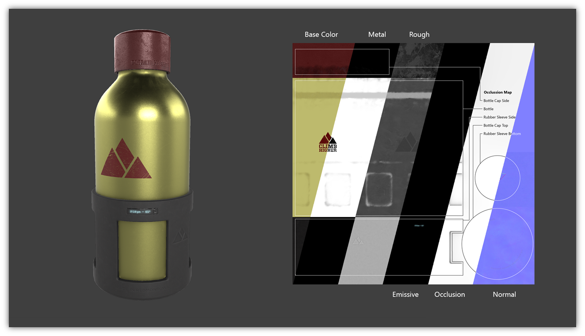
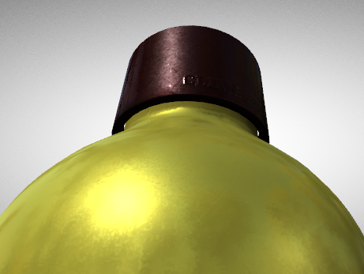
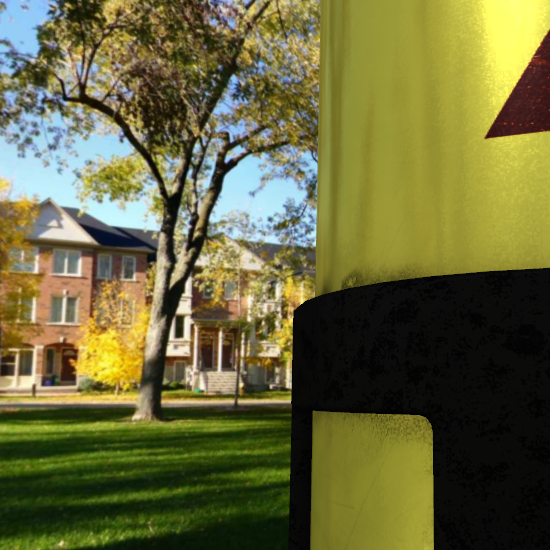
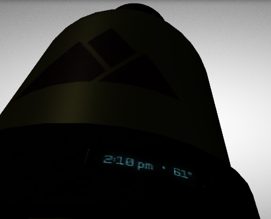
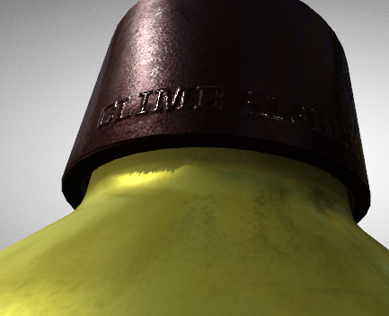

# glTF：An Advanced Material

在前一節的 Simple Texture 範例中，我們看到了如何使用貼圖來指定材質的「base color」，不過除了 base color 以外，glTF 中的材質還可以透過貼圖來定義其他屬性，我們已經在 Materials 一節中簡要列出這些屬性了，包括：

- `Base color`（基礎顏色）
- `Metallic`（金屬度）
- `Roughness`（粗糙度）
- `Emissive`（自發光）
- `Occlusion`（遮蔽／環境遮蔽）
- `Normal map`（法線貼圖）

這些屬性的視覺效果，若只用簡單貼圖很難充分呈現，因此這裡我們使用 Khronos 官方的 PBR 渲染範例模型 [WaterBottle](https://github.com/KhronosGroup/glTF-Sample-Assets/tree/main/Models/WaterBottle)，下圖 14a 展示了該模型所使用的多張材質貼圖，以及最終渲染後的成果：

實作 PBR 的技術細節並非本教學的重點，若對這部分有興趣，可參考 Khronos 官方的 [glTF Sample Viewer](https://github.com/KhronosGroup/glTF-Sample-Viewer) ，它提供一套基於 WebGL 的 PBR 渲染器參考實作，並附帶背景說明與技巧提示

下圖 14b 顯示了 roughness 貼圖的效果，瓶身主要區域因 roughness 值較低而顯得光滑，且具有光澤，而瓶蓋部分因表面 roughness 較高而呈現粗糙、不鏡面反射的質感：

下圖 14c 顯示了 metallic 貼圖的效果，瓶身根據金屬度貼圖，會反射來自環境貼圖中的環境光源：

下圖 14d 顯示了 emissive 貼圖的效果，即便環境光很暗，貼圖中指定為自發光區域的文字依然清晰可見：

圖 14e 顯示了瓶蓋上的 normal map 效果，即便模型幾何解析度很低，透過法線貼圖，文字仍可呈現出壓印進去的浮雕感：

透過這些不同的貼圖（base color、metallic、roughness、normal、emissive⋯），我們可以用相對低的幾何成本來模擬出多樣且真實的材質外觀。 而且因為 glTF 採用共同的 PBR 基礎模型（metallic-roughness），所以即使在不同的渲染器中，也能維持一致的顯示結果
