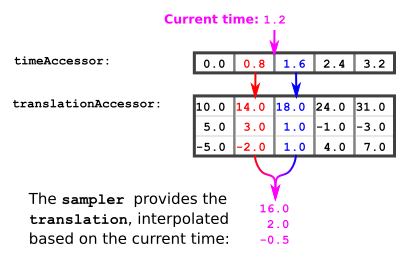
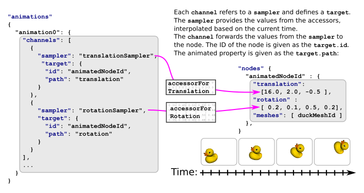

# glTF：Animations

如同在「Simple Animation」的範例中所示，我們可以使用 [`animation`](https://www.khronos.org/registry/glTF/specs/2.0/glTF-2.0.html#reference-animation) 物件來描述節點的 translation（位移）、rotation（旋轉）、或 scale（縮放）這些屬性是如何隨著時間改變的

下面是一個新的 animation 範例，這次的動畫包含了兩個 channel：

- 一個 channel 用來動畫節點的 translation
- 另一個 channel 用來動畫節點的 rotation

```javascript
  "animations": [
    {
      "samplers" : [
        {
          "input" : 2,
          "interpolation" : "LINEAR",
          "output" : 3
        },
        {
          "input" : 2,
          "interpolation" : "LINEAR",
          "output" : 4
        }
      ],
      "channels" : [ 
        {
          "sampler" : 0,
          "target" : {
            "node" : 0,
            "path" : "rotation"
          }
        },
        {
          "sampler" : 1,
          "target" : {
            "node" : 0,
            "path" : "translation"
          }
        } 
      ]
    }
  ],
```

## Animation samplers

`samplers` 陣列內包含 [`animation.sampler`](https://www.khronos.org/registry/glTF/specs/2.0/glTF-2.0.html#reference-animation-sampler) 物件，這些物件會定義要如何在關鍵影格（key frames）之間，對 accessor 提供的數值進行插值（interpolation），如下圖 7a 所示：



以下是一個用來計算「目前動畫時間點下的位移（translation）」的演算法流程：

1. 假設目前的動畫時間為 `currentTime`
2. 從 times accessor 中，找出前一個與後一個關鍵影格時間點：
    ```ini
    previousTime = 在 times accessor 中，小於 currentTime 的最大值  
    nextTime = 在 times accessor 中，大於 currentTime 的最小值
    ``` 
3. 從 translations accessor 中，取出對應這兩個時間點的位移值：
    ```ini
    previousTranslation = 對應 previousTime 的 translation 值  
    nextTranslation = 對應 nextTime 的 translation 值
    ```
4. 計算插值因子（interpolation value）：
    這是一個介於 0.0 到 1.0 之間的數值，表示 `currentTime` 在 `previousTime` 與 `nextTime` 之間的相對位置：
    ```ini
    interpolationValue = (currentTime - previousTime) / (nextTime - previousTime)
    ```
5. 使用插值因子，計算出目前時間點的 translation 值：
    ```ini
    currentTranslation = previousTranslation + interpolationValue × (nextTranslation - previousTranslation)
    ```

### Example:

假設 `currentTime`（目前動畫時間）是 1.2，從 times accessor 中找到小於它的最大元素是 0.8，大於它的最小元素是 1.6。 因此：

```ini
previousTime = 0.8
nextTime     = 1.6
```

接著，查找對應 translations accessor 中的數值：

```ini
previousTranslation = (14.0, 3.0, -2.0)
nextTranslation     = (18.0, 1.0,  1.0)
```

然後計算插值因子（interpolation value）：

```ini
interpolationValue = (currentTime - previousTime) / (nextTime - previousTime)
                   = (1.2 - 0.8) / (1.6 - 0.8)
                   = 0.4 / 0.8         
                   = 0.5
```

再用這個插值因子來計算目前時間點的 translation 值：

```ini
currentTranslation = previousTranslation + interpolationValue * (nextTranslation - previousTranslation)
                   = (14.0, 3.0, -2.0) + 0.5 * ( (18.0, 1.0,  1.0) - (14.0, 3.0, -2.0) )
                   = (14.0, 3.0, -2.0) + 0.5 * (4.0, -2.0, 3.0)
                   = (16.0, 2.0, -0.5)
```

因此，當時間為 1.2 秒時，節點的 translation 值為（16.0, 2.0, -0.5）

## Animation channels

動畫資料中包含了一個 [`animation.channel`](https://www.khronos.org/registry/glTF/specs/2.0/glTF-2.0.html#reference-animation-channel) 物件的陣列，這些 channel 的作用，是建立輸入（input）與輸出（output）之間的連接：

- 輸入是從 sampler 計算出來的數值
- 輸出則是被動畫控制的節點屬性（node property）

因此，每個 channel 都會：

- 使用 sampler 的索引來參考一個 sampler
- 並且包含一個 [`animation.channel.target`](https://www.khronos.org/registry/glTF/specs/2.0/glTF-2.0.html#reference-animation-channel-target) 物件

這個 target：

- 指向要被動畫影響的節點（使用節點的索引）
- 並透過 path 屬性指定節點中的哪個屬性（如 translation 或 rotation）要被套用動畫

從 sampler 得到的數值，會被寫入到這個節點屬性中

在上面的範例中，動畫包含兩個 channel：

- 這兩個 channel 都指向同一個節點
- 第一個 channel 的 path 是該節點的 translation
- 第二個 channel 的 path 是該節點的 rotation

因此，所有附加在這個節點上的物件（meshes），都會在動畫中隨著時間被同時平移與旋轉，效果如下圖 7b 所示：



## Interpolation

前面的範例只有用過 `LINEAR` 插值，但在 glTF 資料中，動畫可以使用三種插值模式：

- `STEP`
- `LINEAR`
- `CUBICSPLINE`

### Step

`STEP` 插值其實不是一種真正的插值，它會讓物件在每個關鍵影格之間直接跳變，完全不做過渡或補間。 當一個 sampler 使用 `STEP` 插值時，只需套用對應 `previousTime` 的關鍵影格資料即可

### Linear

`LINEAR` 插值正是前面範例所展示的那種插值方式，一般情況下的公式如下

計算 `interpolationValue`：

```ini
interpolationValue = (currentTime - previousTime) / (nextTime - previousTime)
```

對於純量（scalar）與向量（vector）類型的資料，可以使用線性插值（通常在數學函式庫中叫做 `lerp`），這裡是一段 pseudocode 供參：

```javascript
Point lerp(previousPoint, nextPoint, interpolationValue)
    return previousPoint + interpolationValue * (nextPoint - previousPoint)
```

如果是以四元數（quaternion）表示的旋轉，就必須使用球面線性插值（slerp）來進行補間，以下是 `slerp` 的 pseudocode 實作：

```javascript
Quat slerp(previousQuat, nextQuat, interpolationValue)
    var dotProduct = dot(previousQuat, nextQuat)
    
    //make sure we take the shortest path in case dot Product is negative
    if(dotProduct < 0.0)
        nextQuat = -nextQuat
        dotProduct = -dotProduct
        
    //if the two quaternions are too close to each other, just linear interpolate between the 4D vector
    if(dotProduct > 0.9995)
        return normalize(previousQuat + interpolationValue(nextQuat - previousQuat))

    //perform the spherical linear interpolation
    var theta_0 = acos(dotProduct)
    var theta = interpolationValue * theta_0
    var sin_theta = sin(theta)
    var sin_theta_0 = sin(theta_0)
    
    var scalePreviousQuat = cos(theta) - dotproduct * sin_theta / sin_theta_0
    var scaleNextQuat = sin_theta / sin_theta_0
    return scalePreviousQuat * previousQuat + scaleNextQuat * nextQuat
```

這段範例實作的靈感來自 [Wikipedia 的 slerp 條目](https://en.wikipedia.org/wiki/Slerp)

### Cubic Spline interpolation

相較於線性插值，三次樣條插值（Cubic Spline interpolation）需要的資料更多，不僅需要前一個與下一個關鍵影格的時間與數值，還需要每個關鍵影格的兩個切線向量（tangent vectors），以讓曲線在關鍵影格處變得平滑

這些切線資料是儲存在動畫的 channel 中的，對於每一個由 animation sampler 描述的關鍵影格，animation channel 會包含三個元素：

- 該關鍵影格的輸入切線（input tangent）
- 該關鍵影格的實際值（value）
- 該關鍵影格的輸出切線（output tangent）

輸入與輸出切線是單位向量（normalized vector），在使用前需要乘上關鍵影格的持續時間（deltaTime）來進行縮放：

```ini
deltaTime = nextTime - previousTime
```

若要計算 `currentTime` 時刻的值，你需要從 animation channel 中取得：

- `previousTime` 關鍵影格的輸出切線方向
- `previousTime` 關鍵影格的值
- `nextTime` 關鍵影格的值
- `nextTime` 關鍵影格的輸入切線方向

要注意的是，第一個關鍵影格的輸入切線，以及最後一個關鍵影格的輸出切線會被忽略

接著你要計算實際的切線向量值（已縮放），只需要將 channel 中的方向向量乘上 `deltaTime` 即可：

```ini
previousTangent = deltaTime * previousOutputTangent
nextTangent = deltaTime * nextInputTangent
```

詳細的數學函式定義可以參考 glTF 2.0 規範中的[附錄 C](https://www.khronos.org/registry/glTF/specs/2.0/glTF-2.0.html#appendix-c-interpolation)。 下面是一段對應的三次樣條插值偽程式碼：

```javascript
Point cubicSpline(previousPoint, previousTangent, nextPoint, nextTangent, interpolationValue)
    t = interpolationValue
    t2 = t * t
    t3 = t2 * t

    return (2 * t3 - 3 * t2 + 1) * previousPoint
         + (t3 - 2 * t2 + t) * previousTangent
         + (-2 * t3 + 3 * t2) * nextPoint
         + (t3 - t2) * nextTangent
```
