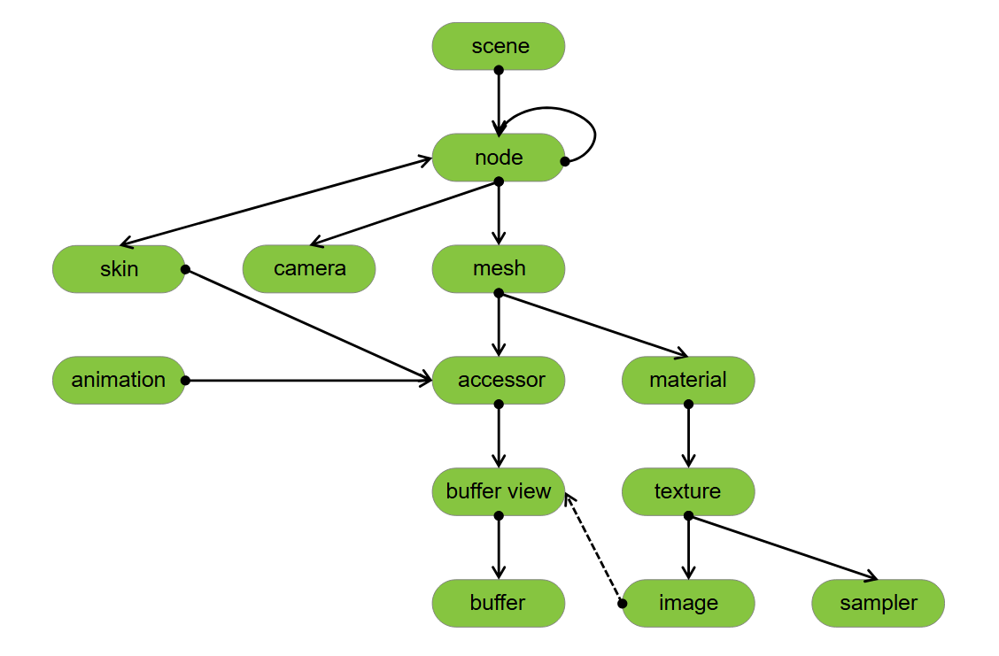
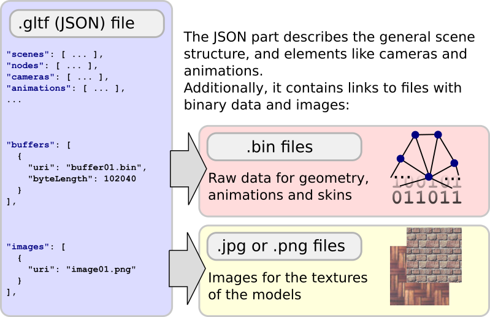

# glTF：The Basic Structure of glTF

glTF 的核心是一個 JSON 檔案，這個檔案描述了整個 3D 場景的內容。 它包含：
- 場景結構本身的描述，這個結構是透過一個節點階層（node hierarchy）來表達的，也就是所謂的場景圖（scene graph）
- 附加在節點上的網格（mesh）定義了場景中出現的 3D 物件
- 材質（material）決定了物件的外觀
- 動畫（animation）描述了 3D 物件隨時間變化（例如旋轉、平移）的方式
- 貼皮（skin）定義了物件的幾何形狀如何根據骨骼姿勢進行變形
- 相機（camera）則描述了渲染時的視角設定

## The JSON structure

場景中的各種物件會以陣列的方式儲存在 JSON 檔案中。 可以透過物件在陣列中的索引值（index）來存取對應的物件：

```javascript
"meshes" : 
[
    { ... }
    { ... }
    ...
],
```

這些索引同時也用來定義物件之間的關係。 上面的例子定義了多個網格，此時節點可以透過引用某個網格的索引，來指定這個節點附加了哪一個網格：

```javascript
"nodes": 
[
    { "mesh": 0, ... },
    { "mesh": 5, ... },
    ...
]
```

下圖（取自 [glTF 概念說明章節](https://www.khronos.org/registry/glTF/specs/2.0/glTF-2.0.html#concepts)）概覽了 glTF asset 中 JSON 部分的最上層元素：



::: tip  
原文是自己額外畫了一張圖，但我覺得 spec 內的圖比較一目了然，所以還是用 spec 內的圖了  
:::

在這裡會簡單介紹這些元素（同時附上連結到 glTF spec 的對應章節），而各元素之間更詳細的關係，會在接下來的章節中進一步說明：

- [`scene`](https://www.khronos.org/registry/glTF/specs/2.0/glTF-2.0.html#reference-scene)：描述 glTF 中儲存的場景內容的起點。 它會參考一組 node，這些 node 構成了場景圖
- [`node`](https://www.khronos.org/registry/glTF/specs/2.0/glTF-2.0.html#reference-node)：場景圖中的單一節點。 每個節點可以包含一個變換（例如旋轉或平移），也可以指向其他（子）節點。 此外，節點可以掛載一個網格或相機，或者掛上一個描述網格變形的貼皮
- [`camera`](https://www.khronos.org/registry/glTF/specs/2.0/glTF-2.0.html#reference-camera)：定義了渲染場景時的視角與配置
- [`mesh`](https://www.khronos.org/registry/glTF/specs/2.0/glTF-2.0.html#reference-mesh)：描述場景中出現的幾何物件。 它會參考 accessor，用來存取實際的幾何資料，也會參考 material，定義物件被渲染時的外觀
- [`skin`](https://www.khronos.org/registry/glTF/specs/2.0/glTF-2.0.html#reference-skin)：定義網格蒙皮（vertex skinning）所需的參數，讓網格可以根據虛擬角色的姿態進行變形。 這些參數的數值是透過 accessor 取得的
- [`animation`](https://www.khronos.org/registry/glTF/specs/2.0/glTF-2.0.html#reference-animation)：描述特定節點（例如旋轉或平移）隨時間變化的方式
- [`accessor`](https://www.khronos.org/registry/glTF/specs/2.0/glTF-2.0.html#reference-accessor)：作為各種資料的抽象來源。 它被網格、貼皮與動畫等使用，負責提供幾何資料、蒙皮參數與隨時間變化的動畫數值。 accessor 會參考 [`bufferView`](https://www.khronos.org/registry/glTF/specs/2.0/glTF-2.0.html#reference-bufferview)，其中 `bufferView` 指的是 [`buffer`](https://www.khronos.org/registry/glTF/specs/2.0/glTF-2.0.html#reference-buffer) 中的某一段原始二進位資料
- [`material`](https://www.khronos.org/registry/glTF/specs/2.0/glTF-2.0.html#reference-material)：包含定義物件外觀的各種參數。 通常會參考一個或多個 `texture` 物件，用來貼到渲染出來的幾何表面上
- [`texture`](https://www.khronos.org/registry/glTF/specs/2.0/glTF-2.0.html#reference-texture)：由 [`sampler`](https://www.khronos.org/registry/glTF/specs/2.0/glTF-2.0.html#reference-sampler) 和 [`image`](https://www.khronos.org/registry/glTF/specs/2.0/glTF-2.0.html#reference-image) 定義。 `sampler` 決定了 `image` 貼到物件表面時的映射方式

## References to external data

3D 物件的二進位資料，例如幾何資訊與材質貼圖，通常不會直接儲存在 JSON 檔案內，而是會被存放在專門的外部檔案中，JSON 部分只包含指向這些外部檔案的連結。 這種設計讓二進位資料可以用更緊湊的形式儲存，並能夠高效率地透過網路傳輸。 此外，資料也可以用能夠直接被渲染器（renderer）使用的格式儲存，無需額外解析、解碼或預處理



如上圖所示，glTF 中有兩種類型的物件可能包含指向外部資源的連結，分別是 `buffers` 和 `images`。 這些物件的詳細說明會在後續章節中介紹

## Reading and managing external data

讀取與處理 glTF asset 的第一步是解析 JSON 結構。 當結構解析完成後，[`buffer`](https://www.khronos.org/registry/glTF/specs/2.0/glTF-2.0.html#reference-buffer) 和 [`image`](https://www.khronos.org/registry/glTF/specs/2.0/glTF-2.0.html#reference-image) 物件會分別出現在頂層的 `buffers` 和 `images` 陣列中。 每個這樣的物件可能會指向一塊二進位資料區塊，為了進一步處理，這些資料會被讀入記憶體中。 通常資料會以陣列的形式儲存，並且可以透過與對應的 `buffer` 或 `image` 物件相同的索引值來查詢

## Binary data in `buffers`

一個 [`buffer`](https://www.khronos.org/registry/glTF/specs/2.0/glTF-2.0.html#reference-buffer) 物件會包含一個 URI，指向一個儲存原始二進位資料的檔案：

```javascript
"buffer01": {
    "byteLength": 12352,
    "type": "arraybuffer",
    "uri": "buffer01.bin"
}
```

這段二進位資料本身會是一塊從 URI 指定位置讀取進來的記憶體區塊，不帶有任何固有的意義或結構。 在 Buffers、BufferViews 與 Accessors 的章節中，我們會看到如何透過資料型別與資料布局資訊來解讀這塊原始資料。 舉例來說，資料的一部分可以被解讀為動畫資料，另一部分可以被解讀為幾何資料。 以二進位形式儲存資料比 JSON 格式能更有效率地透過網路傳輸，而且這些資料可以直接傳遞給渲染器使用，而無需額外解碼或預處理

## Image data in `images`

一個 [`image`](https://www.khronos.org/registry/glTF/specs/2.0/glTF-2.0.html#reference-image) 物件可以參考至一個外部圖片檔案，作為渲染物件的貼圖：

```javascript
"image01": {
    "uri": "image01.png"
}
```

這個參考是透過 URI 來設定的，通常指向一個 PNG 或 JPG 檔案。 這些格式可以大幅減少檔案大小，使資料能夠更有效率地在網路上傳輸。 在某些情況下，`image` 物件不一定會參考外部檔案，而是指向儲存在 `buffer` 裡的資料。 這種間接參考的細節，會在 Textures、Images 與 Samplers 章節中進一步說明

## Binary data in data URIs

通常情況下，`buffer` 和 `image` 物件中所包含的 URI 會指向一個外部檔案，檔案中包含了實際的資料。 但也有另一種方式，可以直接將資料以二進位格式嵌入到 JSON 內，這種方法被稱為 [Data URI](https://developer.mozilla.org/en-US/docs/Web/HTTP/Basics_of_HTTP/Data_URIs)
