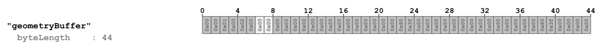
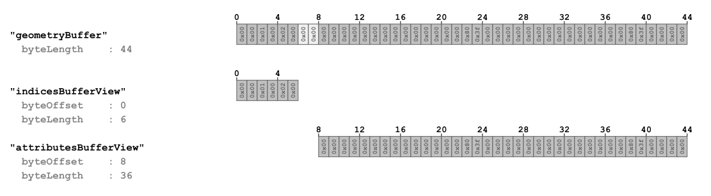
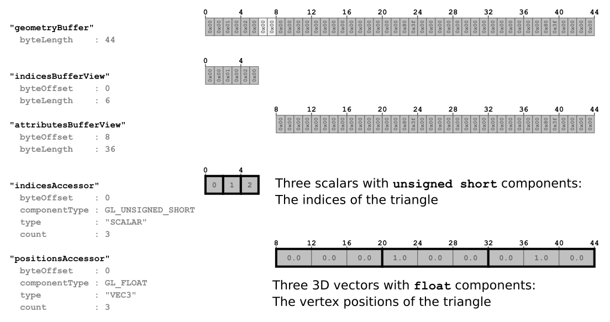
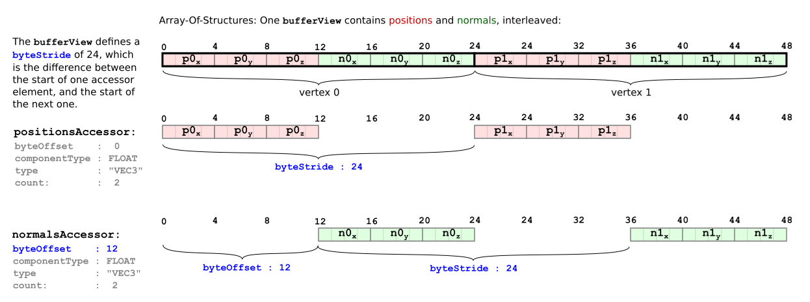
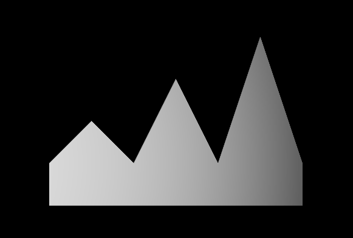
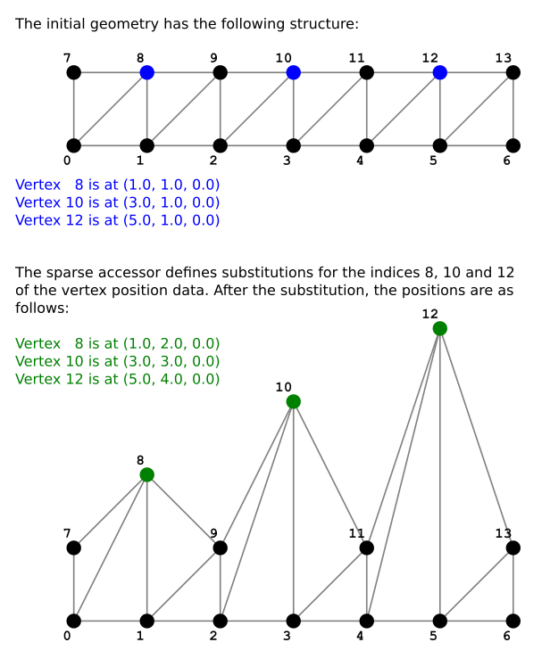

# glTF：Buffers, BufferViews, and Accessors

在「A Minimal glTF File」的章節中已經出現過 `buffer`、`bufferView` 和 `accessor` 物件的範例，本節將會更詳細地說明這些概念

## Buffers

- 外部檔案
- 直接嵌入在 JSON 檔案中的 Data URI

在「A Minimal glTF File」的例子中，`buffer` 的資料長度為 44 byte，並且以 data URI 的方式編碼：

```javascript
  "buffers" : [
    {
      "uri" : "data:application/octet-stream;base64,AAABAAIAAAAAAAAAAAAAAAAAAAAAAIA/AAAAAAAAAAAAAAAAAACAPwAAAAA=",
      "byteLength" : 44
    }
  ],
```



一個 `buffer` 中的某些資料區塊，可能會需要作為頂點屬性（vertex attributes）、索引（indices）、骨骼綁定資訊（skinning information），或者動畫關鍵影格（animation keyframes）等等傳遞給渲染器（renderer）使用。 為了能夠正確使用這些資料，還需要額外描述資料的結構（structure）與型態（type）的資訊

## BufferViews

我們需要透過 [`bufferView`](https://www.khronos.org/registry/glTF/specs/2.0/glTF-2.0.html#reference-bufferview) 物件來完成從 `buffer` 中結構化資料的第一步。 `bufferView` 代表的是某個 buffer 資料中的一個「切片」（slice），這個切片是透過位移量（offset）與長度（length）來定義的（單位都是位元組 byte）

在「A Minimal glTF File」的例子中，定義了兩個 `bufferView` 物件：

```javascript
  "bufferViews" : [
    {
      "buffer" : 0,
      "byteOffset" : 0,
      "byteLength" : 6,
      "target" : 34963
    },
    {
      "buffer" : 0,
      "byteOffset" : 8,
      "byteLength" : 36,
      "target" : 34962
    }
  ],
```

- 第一個 `bufferView` 指向 buffer 中從起始位置開始的前 6 個位元組
- 第二個 `bufferView` 指向 buffer 中從位移 8 個位元組的地方開始，長度為 36 個位元組的資料區段

如下圖所示：



圖中淺灰色的位元組是為了正確對齊 accessor 而用來做填充（padding）的位元組，每個 `bufferView` 還會包含一個 `target` 屬性，這個屬性可以讓渲染器（renderer）知道這段資料的使用性質：

- 如果 `target` 是 `34962`，表示這段資料用來當作頂點屬性（vertex attributes），也就是 OpenGL 中的 `ARRAY_BUFFER`
- 如果 `target` 是 `34963`，表示這段資料用來當作索引資料（vertex indices），也就是 OpenGL 中的 `ELEMENT_ARRAY_BUFFER`

至此，`buffer` 中的資料已經被劃分成多個部分，而每個部分都用了一個 `bufferView` 來描述，但要真正讓渲染器能夠使用這些資料，還需要進一步描述這些資料的型態（type）和結構布局（layout）的資訊，而這就是 accessor 的工作了

## Accessors

[`accessor`](https://www.khronos.org/registry/glTF/specs/2.0/glTF-2.0.html#reference-accessor) 物件會參考一個 `bufferView`，並包含一些屬性來定義該 `bufferView` 中資料的型態（type）與結構布局（layout）

### Data type

accessor 的資料型態是透過 `type` 和 `componentType` 這兩個屬性來描述的：

- `type` 是一個字串，指定其元素是純量（scalar）、向量（vector），還是矩陣（matrix），例如：
  - `"SCALAR"` 代表純量
  - `"VEC3"` 代表三維向量
  - `"MAT4"` 代表 4×4 矩陣
- `componentType` 則指定這些元素中每個分量（component）的資料型別，其會是一個 GL constant，例如：
  - `5126` 表示 `FLOAT`（浮點數）
  - `5123` 表示 `UNSIGNED_SHORT`（無號短整數）

不同 `type` 與 `componentType` 的組合，可以用來描述各種不同的資料型態，在「A Minimal glTF File」的例子中，定義了兩個 accessor：

```javascript
  "accessors" : [
    {
      "bufferView" : 0,
      "byteOffset" : 0,
      "componentType" : 5123,
      "count" : 3,
      "type" : "SCALAR",
      "max" : [ 2 ],
      "min" : [ 0 ]
    },
    {
      "bufferView" : 1,
      "byteOffset" : 0,
      "componentType" : 5126,
      "count" : 3,
      "type" : "VEC3",
      "max" : [ 1.0, 1.0, 0.0 ],
      "min" : [ 0.0, 0.0, 0.0 ]
    }
  ],
```

第一個 accessor 參考了索引為 0 的 `bufferView`，如上所述，這部分 `buffer` 的資料用來存放索引（indices）。 其中 `type` 是 `"SCALAR"`，`componentType` 是 `5123`（`UNSIGNED_SHORT`），也就是說，索引資料是以無號短整數（unsigned short）的純量形式儲存的

第二個 accessor 參考了索引為 1 的 bufferView，這部分 `buffer` 的資料用來存放頂點屬性（vertex attributes），特別是頂點位置（vertex positions）。 其中，`type` 是 `"VEC3"`，`componentType` 是 `5126`（`FLOAT`），也就是說，這個 accessor 描述的是浮點數的三維向量（3D vectors with float components）

### Data layout

`accessor` 還有其他屬性可以進一步指定資料的布局方式：

- `count` 屬性表示這個 `accessor` 包含了多少個資料元素。 在上面的範例中，兩個 accessor 的 `count` 都是 3，分別代表三個索引（indices）與三個頂點（vertices），也就是一個三角形
- 每個 accessor 也都有一個 `byteOffset` 屬性。 在上述例子中，兩個 accessor 的 `byteOffset` 都是 0，因為每個 `bufferView` 都只有對應一個 accessor。 但如果有多個 accessor 參考同一個 `bufferView`，那麼 `byteOffset` 會用來描述該 accessor 的資料是從對應 `bufferView` 中的哪個位元組開始的

### Data alignment

accessor 指向的資料可能會被傳送到顯卡作為渲染用的資料，也可能會在主機端（host side）作為動畫（animation）或骨骼綁定（skinning）資料使用。 因此，accessor 的資料必須依據資料型態（type）正確的進行對齊（alignment）

例如，當 accessor 的 `componentType` 是 `5126`（`FLOAT`）時，因為一個 float 佔 4 個位元組，所以資料必須對齊到 4 位元組邊界（4-byte boundaries）

具體來說，accessor 的對齊要求如下：

- accessor 的 `byteOffset` 必須能夠被其 `componentType` 的大小整除
- accessor 的 `byteOffset` 加上其參考的 `bufferView` 的 `byteOffset`，兩者的總和，也必須能被 componentType 的大小整除

在前面的範例中，索引為 1 的 `bufferView`（對應到頂點屬性資料）故意選擇了 `byteOffset = 8`，就是為了讓頂點位置資料可以符合 4-byte 對齊要求，因此，`buffer` 中的第 6 和第 7 個位元組只是填充位元組（padding bytes），並不攜帶有用資料

圖片 5c 說明了：

- `bufferView` 如何從原始 buffer 切出資料區段
- accessor 如何為這些資料段指定型態資訊



::: tip  
總而言之，buffer 可以想成一個 memory pool，裡面就是存單純的 binary，需要靠 bufferView 和 accessor 的資訊才能解讀。 其中 bufferView 對應到一個物件，負責告訴你這個物件在 buffer 中的哪裡，佔了多大的區域，還有他是哪種 buffer；accessor 則告訴你要怎麼解讀對應 buffer 內的這段 binary

以上圖來說，`accessors[0]` 為：

```json
{
  "bufferView": 0,
  "byteOffset": 0,
  "componentType": 5123, // GL_UNSIGNED_SHORT (2 bytes)
  "count": 3,
  "type": "SCALAR"
}
```

表示：

- 從 `bufferView[0]` 開始讀（也就是 `buffer[0]`）
- 每筆資料是 `GL_UNSIGNED_SHORT`（2 bytes）
- SCALAR 表示一筆資料只有一個數字
- count = 3 → 共有三筆資料 → 共佔 6 bytes，剛好是 `bufferView[0]` 長度

而 `accessors[1]` 為：

```json
{
  "bufferView": 1,
  "byteOffset": 0,
  "componentType": 5126, // GL_FLOAT (4 bytes)
  "count": 3,
  "type": "VEC3"
}
```

表示：

- 從 `bufferView[1]` 開始讀（`buffer[8]`）
- 每筆是 `VEC3`，即 3 個 float
- 每個 float 是 4 bytes → 每筆資料佔 12 bytes
- count = 3 → 三筆資料 → 三個 VEC3 → 共佔 36 bytes，剛好對應 `bufferView[1]` 長度  
:::

### Data interleaving

`bufferView` 有時會採用結構體陣列（Array-Of-Structures，AOS）的格式來存放屬性（attributes）資料，此時單一 `bufferView` 中的資料，可能會交錯地同時包含：

- 頂點位置（vertex positions）
- 頂點法線（vertex normals）

這種情況下 accessor 的 `byteOffset` 用來定義對應屬性中第一筆資料的起始位置，而 `bufferView` 會額外定義一個 `byteStride` 屬性，這個值表示從一筆資料跳到下一筆資料所需要跨過的位元組數

舉例來說，下圖 5d 示範了一個交錯存放 position 和 normal 屬性的 `bufferView`：



### Data contents

每個 accessor 還包含了 `min` 和 `max` 這兩個屬性，用來統整它所管理的資料內容：

- `min` 是每個分量（component-wise）的最小值
- `max` 是每個分量（component-wise）的最大值

以頂點位置（vertex positions）為例，光靠 `min` 和 `max` 就能夠定義出物體的包圍盒（bounding box）

這些資訊可以被用來做：

- 優先下載（prioritized downloads）
- 可見性偵測（visibility detection）

此外，這類資訊在儲存或處理量化（quantized）資料時也很有幫助，渲染器可以在執行期用這些範圍資訊進行去量化（dequantization），但對於量化資料的細節，超出了本教學的範圍，就不再贅述

::: tip  
quantize 基本上就是在做壓縮，你直接查 mesh quantize 或 gltf quantize 之類的應該就可以查到相關的資訊了  
:::

## Sparse accessors

從 glTF 2.0 開始，引入了 Sparse Accessors（稀疏存取器）的概念，這是一種特殊的資料表示方式，允許在資料內容只有少數差異時，以非常精簡的形式儲存多個資料區塊

舉個例子，假設有一份頂點位置（vertex positions）的幾何資料（geometry data），這份資料要被多個物件共用，兩個物件之間大多數頂點的位置是相同的，只有少數幾個頂點不同。 此時我們就不需要複製整份資料來儲存，可以先存一次完整的資料，然後用一個 Sparse Accessor，針對第二個物件記錄不同的頂點即可

以下是一個完整的 glTF asset 範例，採用內嵌資料（embedded representation），展示了如何使用 Sparse Accessor：

```javascript
{
  "scenes" : [ {
    "nodes" : [ 0 ]
  } ],
  
  "nodes" : [ {
    "mesh" : 0
  } ],
  
  "meshes" : [ {
    "primitives" : [ {
      "attributes" : {
        "POSITION" : 1
      },
      "indices" : 0
    } ]
  } ],
  
  "buffers" : [ {
    "uri" : "data:application/gltf-buffer;base64,AAAIAAcAAAABAAgAAQAJAAgAAQACAAkAAgAKAAkAAgADAAoAAwALAAoAAwAEAAsABAAMAAsABAAFAAwABQANAAwABQAGAA0AAAAAAAAAAAAAAAAAAACAPwAAAAAAAAAAAAAAQAAAAAAAAAAAAABAQAAAAAAAAAAAAACAQAAAAAAAAAAAAACgQAAAAAAAAAAAAADAQAAAAAAAAAAAAAAAAAAAgD8AAAAAAACAPwAAgD8AAAAAAAAAQAAAgD8AAAAAAABAQAAAgD8AAAAAAACAQAAAgD8AAAAAAACgQAAAgD8AAAAAAADAQAAAgD8AAAAACAAKAAwAAAAAAIA/AAAAQAAAAAAAAEBAAABAQAAAAAAAAKBAAACAQAAAAAA=",
    "byteLength" : 284
  } ],
  
  "bufferViews" : [ {
    "buffer" : 0,
    "byteOffset" : 0,
    "byteLength" : 72,
    "target" : 34963
  }, {
    "buffer" : 0,
    "byteOffset" : 72,
    "byteLength" : 168
  }, {
    "buffer" : 0,
    "byteOffset" : 240,
    "byteLength" : 6
  }, {
    "buffer" : 0,
    "byteOffset" : 248,
    "byteLength" : 36
  } ],
  
  "accessors" : [ {
    "bufferView" : 0,
    "byteOffset" : 0,
    "componentType" : 5123,
    "count" : 36,
    "type" : "SCALAR",
    "max" : [ 13 ],
    "min" : [ 0 ]
  }, {
    "bufferView" : 1,
    "byteOffset" : 0,
    "componentType" : 5126,
    "count" : 14,
    "type" : "VEC3",
    "max" : [ 6.0, 4.0, 0.0 ],
    "min" : [ 0.0, 0.0, 0.0 ],
    "sparse" : {
      "count" : 3,
      "indices" : {
        "bufferView" : 2,
        "byteOffset" : 0,
        "componentType" : 5123
      },
      "values" : {
        "bufferView" : 3,
        "byteOffset" : 0
      }
    }
  } ],
  
  "asset" : {
    "version" : "2.0"
  }
}
```

渲染結果如下圖 5e 所示：



這個範例中包含了兩個 accessor：

- 一個是網格的索引資料（indices）
- 一個是頂點位置資料（vertex positions）

其中，描述頂點位置的那個 accessor，額外定義了 `accessor.sparse` 屬性，這個屬性包含了替換稀疏資料（sparse data substitution）的相關資訊：

```javascript
  "accessors" : [ 
  ...
  {
    "bufferView" : 1,
    "byteOffset" : 0,
    "componentType" : 5126,
    "count" : 14,
    "type" : "VEC3",
    "max" : [ 6.0, 4.0, 0.0 ],
    "min" : [ 0.0, 0.0, 0.0 ],
    "sparse" : {
      "count" : 3,
      "indices" : {
        "bufferView" : 2,
        "byteOffset" : 0,
        "componentType" : 5123
      },
      "values" : {
        "bufferView" : 3,
        "byteOffset" : 0
      }
    }
  } ],
```

這個 `sparse` 物件本身定義了：

- 要被替換的元素數量（`count`）
- `sparse.indices`：指向一個 `bufferView`，裡面存著要被替換的元素索引
- `sparse.values`：指向一個 `bufferView`，裡面存著用來替換的新資料

在這個範例中，原本的幾何資料存放在索引為 1 的 `bufferView` 內，這份資料描述的是一個矩形陣列的頂點（rectangular array of vertices），其中：

- `sparse.indices` 指向索引為 2 的 `bufferView`，其中包含索引值 `[8, 10, 12]`
- `sparse.values` 指向索引為 3 的 `bufferView`，其中包含新的頂點位置資料 `[(1,2,0), (3,3,0), (5,4,0)]`

套用這些替換後的結果如下圖 5f 所示：


