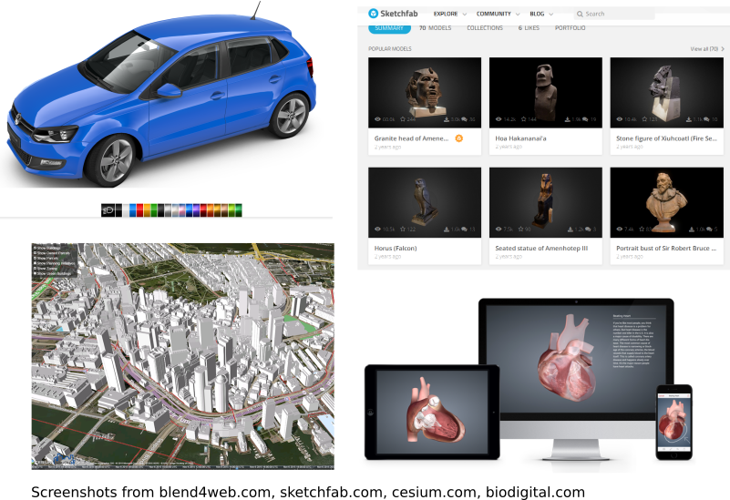
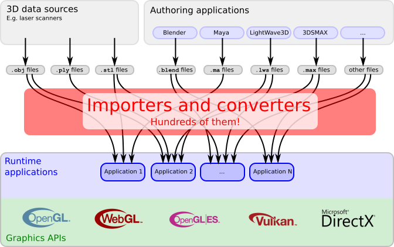
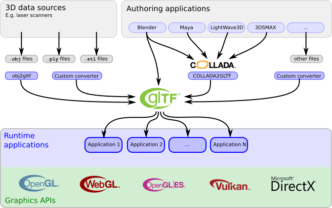

# glTF：Introduction to glTF using WebGL

現代越來越多應用程式和服務都以 3D 內容為基礎。 像是線上商店提供支援 3D 預覽的產品配置器、博物館利用 3D 掃描技術數位化館藏，讓參觀者能在虛擬畫廊中自由探索。 都市規劃師使用 3D 城市模型來進行規劃與資訊可視化，教育工作者也常透過互動式、動畫化的人體 3D 模型輔助教學。 這些應用現在多數都能直接在網頁瀏覽器中運作，這得歸功於現代瀏覽器全面支援 WebGL 的高效渲染技術

隨著各領域對 3D 內容的需求持續成長，通常 3D 資料需要透過網路傳輸，並在客戶端做高效渲染。 不過，過去一直存在一個問題：從 3D 內容創作到應用程式中高效渲染之間，缺乏良好的銜接流程

::: tip  
所謂的 3D 內容（3D Content）並不只是指 3D model，它是一個更大的概念，可能包含了一整個場景，因此可能會有：
- 多個 3D model
- 場景結構（Scene Graph）
- 燈光（Lights）
- 相機（Cameras）
- 材質（Materials）
- 動畫（Animations）
- 特效（Effects）
- 物理屬性（例如碰撞、重量等）

而在講 Content 的時候通常是在討論資料的意義，偏向概念層面，如果講的是 Asset，則是偏向實體檔案層面，例如一個 `.gltf` 檔、一個 `.bin` 檔之類的  
:::

## 3D content pipelines

現代拿來在客戶端渲染的 3D 資料，來源眾多，檔案格式也五花八門。 [維基百科上的 3D 圖形檔案格式列表](https://en.wikipedia.org/wiki/List_of_file_formats#3D_graphics)列出了超過 70 種不同的 3D 檔案格式，各自針對不同需求與應用場景而設計

例如，透過 3D 掃描器獲得的原始 3D 資料，通常會以 [OBJ](https://en.wikipedia.org/wiki/Wavefront_.obj_file)、[PLY](https://en.wikipedia.org/wiki/PLY_(file_format)) 或 [STL](https://en.wikipedia.org/wiki/STL_(file_format)) 格式儲存。 這些檔案記錄了單一物體的幾何資料，但並不包含場景結構或物體該如何渲染的資訊

若要建立更完整、複雜的 3D 場景，通常會使用專業的內容創作工具來進行。 這些工具能編輯場景結構、燈光配置、相機、動畫，當然也包括物件的 3D 幾何資訊。不同的工具會使用自己的專屬檔案格式，例如 [Blender](https://www.blender.org/) 的 `.blend`、[LightWave3D](https://www.lightwave3d.com/) 的 `.lws`、[3ds Max](https://www.autodesk.com/3dsmax) 的 `.max`，以及 [Maya](https://www.autodesk.com/maya) 的 `.ma`

要在應用程式中渲染這些 3D 內容，其必須能讀取多種不同的檔案格式。 這不只要解析場景結構，還要將幾何資料轉換成圖形 API（像是 OpenGL 或 WebGL）能使用的格式，並傳送到顯示卡記憶體中，接著才能透過一連串 API 呼叫來完成渲染。 因此，每個應用程式都得為自己支援的檔案格式撰寫相對應的匯入器、載入器或轉換器，如下圖 1b 所示：

## glTF: A transmission format for 3D scenes

glTF 的目標是建立一個用來描述 3D 內容的標準，使其適合直接在應用程式使用。 現有的許多檔案格式並不適合這樣的情境，有些格式只包含幾何資料，並未記錄任何場景資訊；有些則是設計來讓內容創作工具之間交換資料，主要目的是保留盡可能完整的 3D 場景資訊，結果往往導致檔案龐大、結構複雜且難以解析。 此外，這些格式中的幾何資料通常還需要額外的預處理，才能在客戶端應用程式中渲染

過去，沒有任何一種既有的檔案格式，是真正針對「高效能地在網路上傳輸並渲染 3D 場景」這個需求設計的。 glTF 便是為了這個滿足需求而產生的，是一個專門為了 3D 場景傳輸而設計的傳輸格式（transmission format）：

- 場景結構以 JSON 描述，格式緊湊且易於解析
- 物件的 3D 資料以能夠直接被主流圖形 API（如 OpenGL、WebGL）使用的方式儲存，避免了解碼或預處理的額外負擔

現在，各種內容創作工具也逐漸支援將 3D 內容直接以 glTF 格式匯出；而越來越多的客戶端應用程式也能直接載入並渲染 glTF 檔案。 這樣，glTF 就能像下圖 1c 所示，幫助打通「內容創作」與「即時渲染」之間的鴻溝：

現在也有越來越多的內容創作工具直接內建了 glTF 的匯入與匯出功能。 例如，Blender 的官方手冊就有詳細說明如何[使用 glTF 匯入與匯出 PBR 材質](https://docs.blender.org/manual/en/latest/addons/import_export/scene_gltf2.html)。 除此之外，也可以先使用其他檔案格式製作 3D 內容，再透過開源的轉換工具，將它們轉換成 glTF 格式，這些工具可以在 [glTF Project Explorer](https://github.khronos.org/glTF-Project-Explorer/) 中找到。 轉換完成後，還可以使用 [Khronos glTF Validator](https://github.khronos.org/glTF-Validator/) 來檢查檔案是否符合規範
