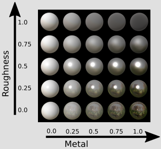

# glTF：Materials

## Introduction

glTF 的目的是為了定義一種用於傳輸 3D asset 的格式，如前面幾節所示，這包括了場景結構（scene structure）與場景中出現的幾何物件，但 glTF asset 也可以包含物件的外觀資訊，也就是表示描述物件在畫面上應該被如何渲染的資訊

材質屬性（material properties）可以用不同方式來表示，而所謂的「著色模型（shading model）」則用來描述這些屬性該如何被處理，像 [Phong](https://en.wikipedia.org/wiki/Phong_reflection_model) 或 [Blinn-Phong](https://en.wikipedia.org/wiki/Blinn%E2%80%93Phong_shading_model) 這樣的簡單著色模型，在 OpenGL 或 WebGL 等常見的圖形 API 中是直接支援的

這些著色模型會根據一組基本的材質參數來運作，例如：

- 物件表面反射漫射光的顏色（通常用貼圖表示）
- 反射鏡面光的顏色
- 光澤度參數（shininess）

很多 3D 檔案格式就是以這些參數為主，例如 [Wavefront OBJ](https://en.wikipedia.org/wiki/Wavefront_.obj_file) 通常會搭配 `MTL` 檔案，用來描述貼圖與顏色資訊，渲染器可以讀取這些資訊並依據它們來渲染物件。 但若要描述更寫實（realistic）的材質，就需要更進階的著色模型與材質模型

## Physically-Based Rendering (PBR)

為了讓渲染器在不同光照條件下都能呈現寫實的外觀，著色模型必須考慮物件表面的物理特性。 實體材質屬性（physical material properties）有多種表示方式，glTF 採用的是其中最常見的一種：metallic-roughness 模型

這個模型會用三個主要參數來描述表面：

- Base color（基礎顏色）：也就是物體表面主要的顏色
- Metallic（金屬度）：表示材質有多少呈現金屬反射行為
- Roughness（粗糙度）：描述表面有多粗糙，進而影響光線的散射程度

glTF 採用這個 metallic-roughness 表示方式作為內建的材質模型其他模型（如 specular-glossiness 模型）則是透過 extensions 支援

下圖展示了不同 metallic 與 roughness 數值所產生的效果：

base color、metallic 和 roughness 這三個屬性可以直接指定單一數值，套用至整個物體。 若希望物體表面的不同部分有不同材質效果，也可以用貼圖（texture）來指定，透過貼圖，可以模擬出更豐富且寫實的真實世界材質

根據所選的著色模型，還可以套用額外的材質效果，這些通常是貼圖與縮放係數的組合，例如：

- Emissive 貼圖：描述物體表面哪些部分會發光（指定發光顏色）
- Occlusion 貼圖：用來模擬遮蔽與自我陰影的效果
- Normal Map 法線貼圖：修改表面的法線方向，讓低多邊形模型也能看起來有細節（不增加幾何複雜度）

glTF 對這些附加屬性都有內建支援，而當這些屬性未提供時，規範也定義了合理的預設值。 接下來的章節會說明 glTF 中如何編碼這些材質屬性，並展示幾種材質的範例：

- A Simple Material
- Textures, Images, and Samplers：定義材質屬性的基礎
- A Simple Texture：展示如何使用貼圖來套用材質
- An Advanced Material：結合多張貼圖以實現更精緻的表面效果
