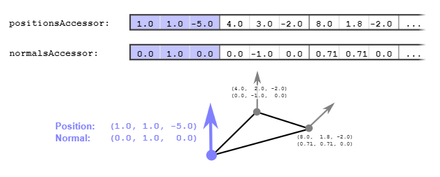

# glTF：Meshes

在前一節的「Simple Meshes」範例中，我們看到了如何定義一個基本的 [`mesh`](https://www.khronos.org/registry/glTF/specs/2.0/glTF-2.0.html#reference-mesh)，其中包含了一個 [`mesh.primitive`](https://www.khronos.org/registry/glTF/specs/2.0/glTF-2.0.html#reference-mesh-primitive) 物件，該物件定義了多個屬性

本節將會說明：

- `mesh.primitive` 的意義與用途
- 如何將 mesh 附加到場景圖（scene graph）的節點中
- 以及如何使用不同材質來渲染這些 mesh

## Mesh primitives

每個 `mesh` 包含一個 `mesh.primitive` 陣列，這些 mesh primitive 是大型物件的子部分或組件，每個 mesh primitive 都統整了該部分在渲染時所需的所有資訊

### Mesh primitive attributes

mesh primitive 會透過 `attributes` 字典來定義幾何資料，這些幾何資料是藉由指向 `accessor` 物件的方式提供的，而這些 `accessor` 則包含了實際的頂點屬性資料

在下面這個範例中，`attributes` 字典中有兩筆資料，它們分別指向 `positionsAccessor` 和 `normalsAccessor`：

```javascript
  "meshes" : [
    {
      "primitives" : [ {
        "attributes" : {
          "POSITION" : 1,
          "NORMAL" : 2
        },
        "indices" : 0
      } ]
    }
  ],
```

這些 accessor 所對應的元素共同定義了每個頂點所擁有的屬性，如下圖 9a 所示：



### Indexed and non-indexed geometry

一個 `mesh.primitive` 的幾何資料可以是有索引（indexed）或無索引（non-indexed）的，在本例中，`mesh.primitive` 採用的是有索引的方法

這可由其 indices 屬性得知，它指向 index 為 0 的 accessor，該 accessor 提供了索引資料。 若是無索引的幾何資料，則不會定義 `indices` 屬性

### Mesh primitive mode  

預設情況下，幾何資料會被視為是三角形網格（triangle mesh）

- 若是有索引的情況，表示每三個連續的 indices 值組成一個三角形
- 若無索引，則每三筆 vertex attribute 的資料就被當成一個三角形的三個頂點

除此之外，也可以使用其他幾何繪製模式，例如點（points）、線段（lines）、三角形帶（triangle strips）等。 這些由 `mode` 屬性指定，它是一個數值常數，決定資料如何被解讀

舉例來說：

- `mode = 0` 表示繪製點（對應 GL 常數 `POINTS`）
- `mode = 4` 表示繪製三角形（對應 `TRIANGLES`）。

完整的 mode 數值對照可參考 [`primitive.mode` specification](https://www.khronos.org/registry/glTF/specs/2.0/glTF-2.0.html#_mesh_primitive_mode)

### Mesh primitive material

mesh primitive 還可以透過 `material` 屬性指定該 primitive 要使用哪個材質來渲染，這是透過材質的索引來進行指定的。 在目前的範例中，primitive 沒有指定 `material`，因此物件將會使用預設材質來渲染，這個預設材質會讓物件呈現為統一的 50% 灰色

關於材質（material）與相關概念的詳細說明，會在後面的 Materials 章節中介紹

## Meshes attached to nodes

在 Simple Meshes 的範例中，有一個 `scene` 屬性，其中包含兩個節點，而這兩個節點都參考了相同的 `mesh`（index 為 0）：

```javascript
  "scenes" : [
    {
      "nodes" : [ 0, 1 ]
    }
  ],
  "nodes" : [
    {
      "mesh" : 0
    },
    {
      "mesh" : 0,
      "translation" : [ 1.0, 0.0, 0.0 ]
    }
  ],
  
  "meshes" : [
    { ... } 
  ],
```

第二個 node 有一個 `translation` 屬性，正如 Scenes and Nodes 一章中所說，這個 translation 會被用來計算該節點的 local transform 矩陣，在這裡，它會造成 x 軸方向的平移 1.0。 而將所有節點的 local transform 相乘會得到 global transform，所有附加在該節點上的物件，都會以這個 global transform 進行渲染

因此，在本範例中：

- 同一個 mesh 被附加在兩個 node 上
- 所以這個 mesh 會被渲染兩次：
    - 一次使用第一個節點的 global transform（也就是單位矩陣，不移動）
    - 一次使用第二個節點的 global transform（x 軸方向平移 1.0）
