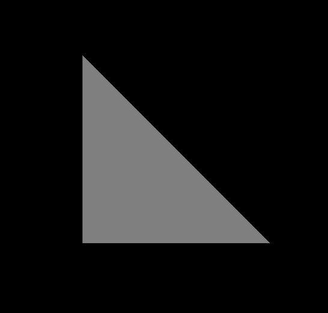

# glTF：A Minimal glTF File

以下是一個最小但完整的 glTF asset 範例，內容包含了一個三角形。 你可以直接將它複製並貼到一個 `.gltf` 檔案中，任何基於 glTF 的應用程式都應該能夠正確載入並渲染它。 本節將會以這個範例為基礎，來說明 glTF 的基本概念

```javascript
{
  "scene": 0,
  "scenes" : [
    {
      "nodes" : [ 0 ]
    }
  ],
  
  "nodes" : [
    {
      "mesh" : 0
    }
  ],
  
  "meshes" : [
    {
      "primitives" : [ {
        "attributes" : {
          "POSITION" : 1
        },
        "indices" : 0
      } ]
    }
  ],

  "buffers" : [
    {
      "uri" : "data:application/octet-stream;base64,AAABAAIAAAAAAAAAAAAAAAAAAAAAAIA/AAAAAAAAAAAAAAAAAACAPwAAAAA=",
      "byteLength" : 44
    }
  ],
  "bufferViews" : [
    {
      "buffer" : 0,
      "byteOffset" : 0,
      "byteLength" : 6,
      "target" : 34963
    },
    {
      "buffer" : 0,
      "byteOffset" : 8,
      "byteLength" : 36,
      "target" : 34962
    }
  ],
  "accessors" : [
    {
      "bufferView" : 0,
      "byteOffset" : 0,
      "componentType" : 5123,
      "count" : 3,
      "type" : "SCALAR",
      "max" : [ 2 ],
      "min" : [ 0 ]
    },
    {
      "bufferView" : 1,
      "byteOffset" : 0,
      "componentType" : 5126,
      "count" : 3,
      "type" : "VEC3",
      "max" : [ 1.0, 1.0, 0.0 ],
      "min" : [ 0.0, 0.0, 0.0 ]
    }
  ],
  
  "asset" : {
    "version" : "2.0"
  }
}
```



## The `scene` and `nodes` structure

陣列 [`scenes`](https://www.khronos.org/registry/glTF/specs/2.0/glTF-2.0.html#reference-scene) 描述 glTF 中場景內容的起點。 在解析 glTF 的 JSON 檔案時，會從這裡開始走訪場景結構。 每個場景（scene）包含一個名為 `nodes` 的陣列，裡面存的是 [`node`](https://www.khronos.org/registry/glTF/specs/2.0/glTF-2.0.html#reference-node) 物件的索引。 這些 node 是場景圖階層結構的根節點

這裡的範例只包含一個場景。 `scene` 屬性指定了在載入 assets 時，預設要顯示的是哪個場景。 這個場景參考了範例中唯一的一個節點（索引為 0）。 而這個節點又參考了唯一的一個網格（mesh），其索引也是 0：

```javascript
  "scene": 0,
  "scenes" : [
    {
      "nodes" : [ 0 ]
    }
  ],
  
  "nodes" : [
    {
      "mesh" : 0
    }
  ],
```

關於 scene 和 node，以及它們各自屬性的更多細節，會在 Scenes 與 Nodes 章節中進一步說明

## The `meshes`

[`mesh`](https://www.khronos.org/registry/glTF/specs/2.0/glTF-2.0.html#reference-mesh) 代表場景中出現的實際幾何物件，通常由一個 [`mesh.primitive`](https://www.khronos.org/registry/glTF/specs/2.0/glTF-2.0.html#reference-mesh-primitive) 的陣列組成，不會直接包含幾何資料。 這些 primitive 是建構大型模型的基本單位，每個 mesh primitive 包含了組成該 mesh 的幾何資料資訊

這個範例中只有一個 mesh，且裡面只包含一個 `mesh.primitive` 物件。 這個 mesh primitive 內有一個 `attributes` 陣列，描述了網格幾何的頂點屬性（vertex attributes）。 在這個範例中，只有一個 `POSITION` 屬性，代表頂點的位置資訊

這個 mesh primitive 透過 `indices` 屬性表明其使用的是「索引（indexed）」幾何資料。 預設情況下，這種索引資料會被解讀為一組組的三角形，每三個連續的索引值對應一個三角形的三個頂點

mesh primitive 的實際幾何資料由 `attributes` 和 `indices` 提供，其會參考 `accessor` 物件，這部分會在下面進一步說明

```javascript
  "meshes" : [
    {
      "primitives" : [ {
        "attributes" : {
          "POSITION" : 1
        },
        "indices" : 0
      } ]
    }
  ],
```

關於 meshes 和 mesh primitives 的更詳細說明，可以再參考後面的 Meshes 章節

## The `buffer`, `bufferView`, and `accessor` concepts

`buffer`、`bufferView` 和 `accessor` 這三種物件提供了 mesh primitive 所需的幾何資料的相關資訊。 這裡會先以本範例來快速介紹，後續會在 Buffers、BufferViews 與 Accessors 的章節中進行更詳細的說明

### Buffers

[`buffer`](https://www.khronos.org/registry/glTF/specs/2.0/glTF-2.0.html#reference-buffer) 定義了一個原始的、無結構的資料區塊，這些資料本身並不帶有任何潛在意義。 一個 buffer 包含一個 `uri`，這個 URI 可以指向一個外部檔案，也可以是 Data URI，直接將二進位資料內嵌在 JSON 檔案中

在這個範例檔案中，採用了第二種方式。 範例中有一個 buffer，包含了 44 bytes，而這段資料是以 Data URI 的形式編碼在 JSON 內的：

```javascript
  "buffers" : [
    {
      "uri" : "data:application/octet-stream;base64,AAABAAIAAAAAAAAAAAAAAAAAAAAAAIA/AAAAAAAAAAAAAAAAAACAPwAAAAA=",
      "byteLength" : 44
    }
  ],
```

這段資料包含了三角形的索引（indices）以及頂點位置（vertex positions）。 但要將這些資料實際用作 mesh primitive 的幾何資料，還需要額外透過 `bufferView` 和 `accessor` 物件來描述這些資料的結構

### Buffer views

[`bufferView`](https://www.khronos.org/registry/glTF/specs/2.0/glTF-2.0.html#reference-bufferview) 用來描述整個原始 buffer 資料中的一個「區塊（chunk）」或「切片（slice）」。 在這個範例中，總共有兩個 buffer view，它們都參考了同一個 buffer

第一個 buffer view 指向 buffer 中存放索引資料的部分，它的 `byteOffset` 是 0（也就是從整個 buffer 的開頭開始），`byteLength` 是 6，表示這段資料長度為 6 個位元組。 第二個 buffer view 則指向 buffer 中存放頂點位置（vertex positions）資料的部分，它的 `byteOffset` 是 8，`byteLength` 是 36，也就是從第 8 個位元組開始，直到整個 buffer 結束為止

範例的 JSON 片段如下：

```javascript
  "bufferViews" : [
    {
      "buffer" : 0,
      "byteOffset" : 0,
      "byteLength" : 6,
      "target" : 34963
    },
    {
      "buffer" : 0,
      "byteOffset" : 8,
      "byteLength" : 36,
      "target" : 34962
    }
  ],
```

### Accessors

資料結構化的工作是透過 [`accessor`](https://www.khronos.org/registry/glTF/specs/2.0/glTF-2.0.html#reference-accessor) 物件來完成，其會定義 `bufferView` 中的資料該如何解讀，並提供資料型別與資料布局的相關資訊

::: tip  
這裡的結構化，或是後面提到的「structural information（結構資訊）」是指附加在原始資料（raw data）之上，用來說明這些資料該怎麼被解讀、怎麼被排列、型別是什麼的額外描述資訊

用 glTF 動畫的例子來講：

- `buffer`：
  純粹就是一連串的位元組（binary data），本身沒有結構意義，例如：「100 bytes 的資料」
- `bufferView`：
  把 `buffer` 切成小塊，但仍然不知道這些 bytes 是代表 float？還是 short？是一個數字還是一組向量？
- `accessor`（這就是 Structural Information）：
  其告訴你這段資料的結構：
    - 資料型態是 `FLOAT`
    - 每個元素是 `VEC4`（四個 float）
    - 總共有多少筆資料（count）
    - 每筆資料佔多少位元組（根據型態推得）

這就是 structural information，把純資料加上「型別」「數量」「佈局」的說明，讓渲染器（或讀取程式）知道怎麼正確地去解讀這些二進位資料  
:::

在這個範例中，總共有兩個 accessor 物件：

第一個 accessor 描述的是幾何資料的索引（indices）。 它參考了索引為 0 的 `bufferView`，也就是包含索引原始資料的那一段 `buffer`。 此外，它還指定了元素的 `count`（數量）、`type`（資料結構類型），以及 `componentType`（基本資料型別）。 在這個例子中，總共有 3 個 scalar 元素，其 component type 為 `5123`，對應到 `unsigned short` 型別

第二個 accessor 描述的是頂點位置（vertex positions）。 它透過索引為 1 的 `bufferView` 參考到相關的 buffer 資料區塊，並且它的 `count`、`type`、`componentType` 屬性說明了這裡有三個元素，每個元素是一個 3 維向量，且每個分量都是 `float` 型別

範例中的 JSON 如下：

```javascript
  "accessors" : [
    {
      "bufferView" : 0,
      "byteOffset" : 0,
      "componentType" : 5123,
      "count" : 3,
      "type" : "SCALAR",
      "max" : [ 2 ],
      "min" : [ 0 ]
    },
    {
      "bufferView" : 1,
      "byteOffset" : 0,
      "componentType" : 5126,
      "count" : 3,
      "type" : "VEC3",
      "max" : [ 1.0, 1.0, 0.0 ],
      "min" : [ 0.0, 0.0, 0.0 ]
    }
  ],
```

如上所述，一個 `mesh.primitive` 現在就可以透過索引來參考這些 accessors：

```javascript
  "meshes" : [
    {
      "primitives" : [ {
        "attributes" : {
          "POSITION" : 1
        },
        "indices" : 0
      } ]
    }
  ],
```

當這個 `mesh.primitive` 需要被渲染時，渲染器會解析底層對應的 bufferView 和 buffer，並將所需的 buffer 資料部分一併傳送給圖形渲染流程，同時使用 accessor 所描述的資料型態與布局資訊。 關於 accessors 資料如何被取得與處理的更詳細說明，會在 Buffers、BufferViews 與 Accessors 章節中介紹

## The `asset` description

在 glTF 1.0 中，這個屬性（asset）仍然是可選的。 但在後續的 glTF 版本中，JSON 檔案中必須包含一個 `asset` 屬性，而且這個屬性中要標明 version 版本號

下例表示該 asset 符合 glTF 2.0 版：

```javascript
  "asset" : {
    "version" : "2.0"
  }
```

`asset` 屬性也可以包含其他額外的中繼資料，相關細節可參考 [asset 的規範](https://www.khronos.org/registry/glTF/specs/2.0/glTF-2.0.html#reference-asset)說明
