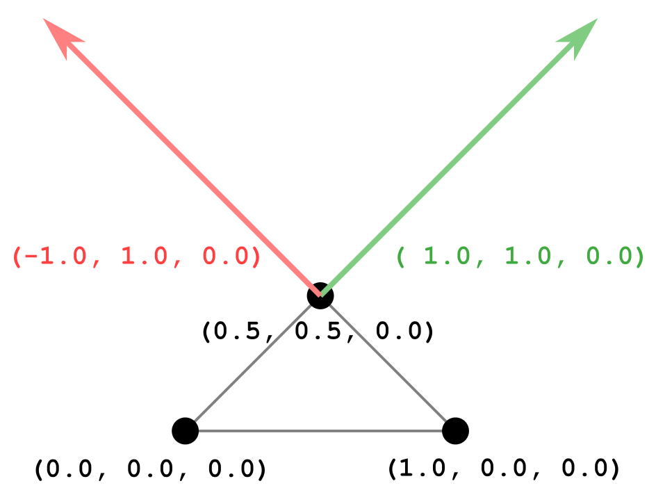
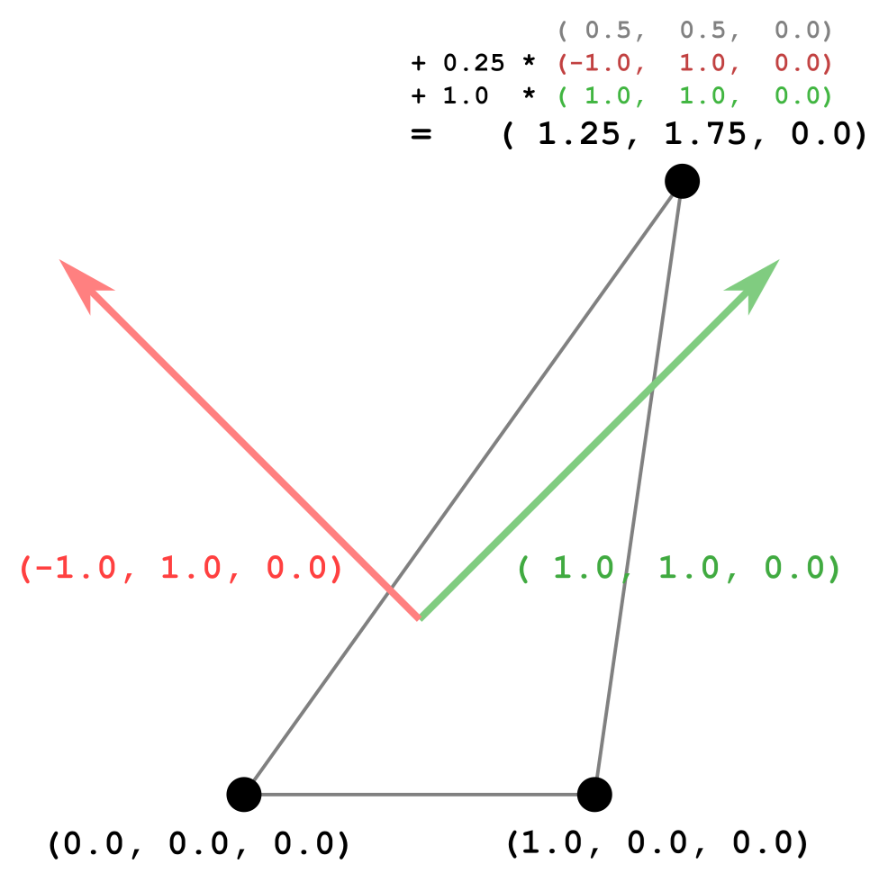

# Morph Targets

前一節的範例展示了一個 mesh，這個 mesh 是由一個三角形構成，並且定義了兩個 morph target（變形目標）：

```javascript
...
  "meshes":[
    {
      "primitives":[
        {
          "attributes":{
            "POSITION":1
          },
          "targets":[
            {
              "POSITION":2
            },
            {
              "POSITION":3
            }
          ],
          "indices":0
        }
      ],
      "weights":[
        1.0,
        0.5
      ]
    }
  ],
```

這個 mesh 的基礎幾何資料（即原始的三角形幾何）是由 `mesh.primitive` 裡 `"attributes"` 內的 `"POSITION"` 所定義的，而 `mesh.primitive` 的 `targets` 則是一個陣列，其每個元素都是一個字典，將 `"POSITION"` 對應到某個 `accessor`，這些 accessor 含有每個頂點的位移（displacement）資訊

下圖 18a 展示了初始三角形的幾何（黑色），第一個 morph target 的位移（紅色），與第二個 morph target 的位移（綠色）：



這個 mesh 中的 `weights` 用來決定要將這些 morph target 的位移要加到多少量到原始幾何上，以得到目前的幾何狀態。 下面的 pseudocode 說明 mesh `primitive` 的渲染頂點位置怎麼算：

```ini
renderedPrimitive.POSITION = primitive.POSITION
                            + weights[0] * primitive.targets[0].POSITION
                            + weights[1] * primitive.targets[1].POSITION;
```

這代表渲染時會取出原始幾何（primitive.POSITION），再加上 morph target 位移的線性組合，其中 `weights` 是這組線性組合的係數

此外，這個 asset 還定義了一段動畫來變化 morph target 的 weights，關鍵幀如下表：

<center-panel natural>

| Time | Weights   |
|:----:|:---------:|
|  0.0 | 0.0, 0.0  |
|  1.0 | 0.0, 1.0  |
|  2.0 | 1.0, 1.0  |
|  3.0 | 1.0, 0.0  |
|  4.0 | 0.0, 0.0  |

</center-panel>

在整段動畫過程中，這些權重會以線性方式內插，並套用到 morph target 上。 每當權重更新，就會重新計算 mesh primitive 的渲染結果

以下是動畫時間為 1.25 秒時的狀態，此時動畫 sampler 給出的權重為 `(0.25, 1.0)`，會拿來對 morph target 的位移做線性組合：


