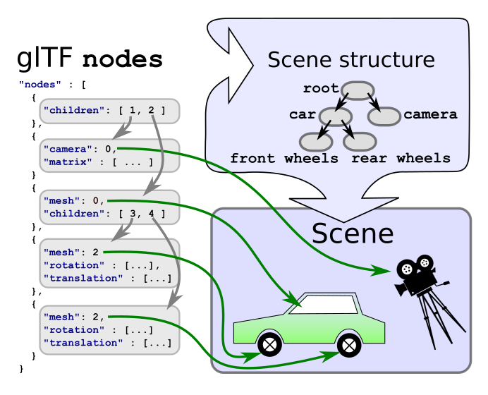

# glTF：Scenes and Nodes

## Scenes

一個 glTF 檔案中可以儲存多個場景，`scene` 屬性用來指定這些場景中哪一個應該作為載入 asset 時預設顯示的場景。 每個 scene 包含一個 `nodes` 陣列，裡面是場景圖根節點的索引。 同樣地，一個場景可以有多個根節點，形成不同的階層結構，不過一般情況下通常只會有一個根節點

下面是一個最簡單的場景描述形式，在前一節已經出現過了，它只包含一個場景和一個節點：

```javascript
  "scene": 0, 
  "scenes" : [
    {
      "nodes" : [ 0 ]
    }
  ],

  "nodes" : [
    {
      "mesh" : 0
    }
  ],
```

表示：

- `"scene": 0`
  - 指定預設要載入的 scene，是 `scenes` 陣列中的第 0 個。
- `"scenes": [{ "nodes": [0] }]`
  - `scenes[0]` 這個場景中有一個 root node：`nodes[0]`
- `"nodes": [{ "mesh": 0 }]`
  - `nodes[0]` 裡有一個 mesh，是 `meshes[0]`

## Nodes forming the scene graph

每個 [`node`](https://www.khronos.org/registry/glTF/specs/2.0/glTF-2.0.html#reference-node) 都可以包含一個名為 `children` 的陣列，裡面存的是它的子節點的索引。 因此，每個 node 都是節點階層結構中的一個元素，這些節點彼此組合起來，就構成了場景的結構，也就是所謂的場景圖（scene graph）



在 `scene` 中列出的每一個節點，都可以透過走訪的方式，遞迴地拜訪它們的所有子節點，以處理所有附加在這些節點上的元素。 簡化版的走訪流程（pseudocode）可能長這樣：

```c
traverse(node) {
    // Process the meshes, cameras, etc., that are
    // attached to this node - discussed later
    processElements(node);

    // Recursively process all children
    for each (child in node.children) {
        traverse(child);
    }
}
```

實際上，在進行走訪時還需要額外的資訊：

- 某些附加在節點上的元素，處理時需要知道它們是附加在哪個節點上的
- 而且，節點的變換資訊需要在走訪過程中累積起來

::: tip  
在 glTF 的場景圖裡，每個節點都可以有自己的變換，也就是：

- 位移（translation）
- 旋轉（rotation）
- 縮放（scale）

這些變換定義了「這個節點的座標系」相對於它的父節點的位置關係。 所以，當你要算一個節點的最終世界座標（world transform）時，你必須從 root node 開始，沿著樹一路累積每一層的變換

這就是上方提到的「累積」的意思  
:::

### Local and global transforms

每個節點都可以擁有一個變換，這個變換可以包含位移（translation）、旋轉（rotation）和縮放（scale），其會套用到附加在該節點上的所有元素，以及該節點底下的所有子節點

透過節點之間的階層結構，可以組織並管理套用到場景元素上的位移、旋轉與縮放變換

#### Local transforms of nodes

節點的區域變換有不同的表示方式，變換可以透過節點的 matrix 屬性給出，其為一個包含 16 個浮點數的 column-major order 的陣列

下面這個矩陣描述了：

- 一個縮放操作，縮放比例為 `(2, 1, 0.5)`
- 一個繞 x 軸旋轉 30 度
- 一個位移操作 `(10, 20, 30)`

```javascript
"node0": {
    "matrix": [
        2.0,    0.0,    0.0,    0.0,
        0.0,    0.866,  0.5,    0.0,
        0.0,   -0.25,   0.433,  0.0,
       10.0,   20.0,   30.0,    1.0
    ]
}    
```

這定義的矩陣如下所示：

$$
M = \begin{pmatrix}
2.0 & 0.0 & 0.0 & 10.0 \\
0.0 & 0.866 & -0.25 & 20.0 \\
0.0 & 0.5 & 0.433 & 30.0 \\
0.0 & 0.0 & 0.0 & 1.0
\end{pmatrix}
$$

節點的變換也可以分別使用 `translation`、`rotation` 和 `scale` 屬性來定義，這種方式通常被簡稱為 TRS 表示法：

```javascript
"node0": {
    "translation": [ 10.0, 20.0, 30.0 ],
    "rotation": [ 0.259, 0.0, 0.0, 0.966 ],
    "scale": [ 2.0, 1.0, 0.5 ]
}
```

每一個屬性都可以分別生成一個矩陣，而它們的矩陣乘積就是這個節點的區域變換（local transform）：

`translation` 直接描述了沿著 x、y、z 三個方向的位移。 例如，從 `[10.0, 20.0, 30.0]` 的 translation，可以建立一個將這組數值放在矩陣最後一個 row 的平移矩陣，如下所示：

$$
T = \begin{pmatrix}
1.0 & 0.0 & 0.0 & 10.0 \\
0.0 & 1.0 & 0.0 & 20.0 \\
0.0 & 0.0 & 1.0 & 30.0 \\
0.0 & 0.0 & 0.0 & 1.0
\end{pmatrix}
$$

`rotation` 是以四元數（quaternion）的形式給出的，本教學不會特別解釋四元數，這裡的重點是四元數可以用緊湊的方式表示「繞任意軸、任意角度的旋轉」。 它會以 `(x, y, z, w)` 的形式儲存，其中 `w` 分量是「旋轉角度的一半」的餘弦值

例如，四元數 `[ 0.259, 0.0, 0.0, 0.966 ]` 表示繞 `x` 軸旋轉約 30 度，其可以轉換成一個旋轉矩陣，如下所示：

$$
R = \begin{pmatrix}
1.0 & 0.0 & 0.0 & 0.0 \\
0.0 & 0.866 & -0.5 & 0.0 \\
0.0 & 0.5 & 0.866 & 0.0 \\
0.0 & 0.0 & 0.0 & 1.0
\end{pmatrix}
$$

`scale`包含了沿著 x、y、z 軸方向的縮放係數，可以透過把這些係數填入矩陣的對角線來建立對應的縮放矩陣， 例如係數 `[ 2.0, 1.0, 0.5 ]` 對應的縮放矩陣如下所示：

$$
S = \begin{pmatrix}
2.0 & 0.0 & 0.0 & 0.0 \\
0.0 & 1.0 & 0.0 & 0.0 \\
0.0 & 0.0 & 0.5 & 0.0 \\
0.0 & 0.0 & 0.0 & 1.0
\end{pmatrix}
$$

在計算節點的最終局部變換矩陣（local transform matrix）時，這些矩陣必須依正確的順序進行相乘，局部變換矩陣的計算方式為

$$
M = T \times R \times S
$$

其中：

- $T$ 是從 `translation`（平移）生成的矩陣
- $R$ 是從 `rotation`（旋轉）生成的矩陣
- $S$ 是從 `scale`（縮放）生成的矩陣

pseudocode 如下：

```cpp
translationMatrix = createTranslationMatrix(node.translation);
rotationMatrix = createRotationMatrix(node.rotation);
scaleMatrix = createScaleMatrix(node.scale);
localTransform = translationMatrix * rotationMatrix * scaleMatrix;
```

以上範例中給出的各個矩陣，經過相乘後，節點的最終局部變換矩陣如下所示：

$$
M = T \times R \times S =
\begin{pmatrix}
2.0 & 0.0 & 0.0 & 10.0 \\
0.0 & 0.866 & -0.25 & 20.0 \\
0.0 & 0.5 & 0.433 & 30.0 \\
0.0 & 0.0 & 0.0 & 1.0
\end{pmatrix}
$$

這個矩陣會讓網格的頂點按照節點中指定的 `scale`、`rotation`、`translation` 屬性，依序進行縮放 → 旋轉 → 平移的變換。 如果節點中沒有提供這三個屬性中的某一個，則會自動使用單位矩陣（identity matrix）代替。 同樣地，如果一個節點既沒有 `matrix` 屬性，也沒有 TRS 屬性，那它的局部變換矩陣就是單位矩陣

#### Global transforms of nodes

不論在 JSON 檔案中是用哪種表示方式，節點的區域變換（local transform）最終都可以儲存成一個 4×4 的矩陣。 而節點的全域變換（global transform）則是從根節點到該節點路徑上，所有區域變換矩陣的連乘結果：

```
結構：                區域變換            全域變換
root                 R                   R
 +- nodeA            A                   R*A
     +- nodeB        B                   R*A*B
     +- nodeC        C                   R*A*C
```

要注意的是，載入 glTF 檔案之後，全域變換並不是一次計算完就結束了，後面會提到，像是動畫可能會動態修改某些節點的區域變換，而這些變動又會影響到所有子節點（descendant nodes）的全域變換

因此，每當需要取得某個節點的 global transform 時，都必須從目前最新的各個節點的 local transforms 重新計算。 實作上也可以通過快取全域變換來優化，並且只在偵測到祖先節點（ancestor nodes）有變動時，才重新更新 global transform

至於這種快取與更新的最佳實作方式，會依據使用的程式語言與應用需求而有所不同，因此本教學就不再多做敘述
