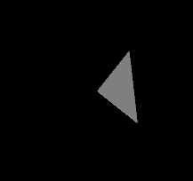

# glTF：A Simple Animation

如同在「Scenes and Nodes」章節中所說的，每個節點都可以有一個局部變換，這個變換可以透過節點的 matrix 屬性來給定，或者是使用 `translation`、`rotation` 和 `scale`（簡稱 TRS）屬性來表示。 當變換是用 TRS 屬性來給定時，我們可以使用 [`animation`](https://www.khronos.org/registry/glTF/specs/2.0/glTF-2.0.html#reference-animation) 來描述節點的 `translation`、`rotation` 或 `scale` 隨時間變化的方式

下面是「Minimal glTF File」章節內給出的範例的擴充，加上了動畫的部分，本節會說明為了新增這個動畫，需要對原本 glTF 檔案做哪些修改與擴充：

```javascript
{
  "scene": 0,
  "scenes" : [
    {
      "nodes" : [ 0 ]
    }
  ],
  
  "nodes" : [
    {
      "mesh" : 0,
      "rotation" : [ 0.0, 0.0, 0.0, 1.0 ]
    }
  ],
  
  "meshes" : [
    {
      "primitives" : [ {
        "attributes" : {
          "POSITION" : 1
        },
        "indices" : 0
      } ]
    }
  ],
  
  "animations": [
    {
      "samplers" : [
        {
          "input" : 2,
          "interpolation" : "LINEAR",
          "output" : 3
        }
      ],
      "channels" : [ {
        "sampler" : 0,
        "target" : {
          "node" : 0,
          "path" : "rotation"
        }
      } ]
    }
  ],

  "buffers" : [
    {
      "uri" : "data:application/octet-stream;base64,AAABAAIAAAAAAAAAAAAAAAAAAAAAAIA/AAAAAAAAAAAAAAAAAACAPwAAAAA=",
      "byteLength" : 44
    },
    {
      "uri" : "data:application/octet-stream;base64,AAAAAAAAgD4AAAA/AABAPwAAgD8AAAAAAAAAAAAAAAAAAIA/AAAAAAAAAAD0/TQ/9P00PwAAAAAAAAAAAACAPwAAAAAAAAAAAAAAAPT9ND/0/TS/AAAAAAAAAAAAAAAAAACAPw==",
      "byteLength" : 100
    }
  ],
  "bufferViews" : [
    {
      "buffer" : 0,
      "byteOffset" : 0,
      "byteLength" : 6,
      "target" : 34963
    },
    {
      "buffer" : 0,
      "byteOffset" : 8,
      "byteLength" : 36,
      "target" : 34962
    },
    {
      "buffer" : 1,
      "byteOffset" : 0,
      "byteLength" : 100
    }
  ],
  "accessors" : [
    {
      "bufferView" : 0,
      "byteOffset" : 0,
      "componentType" : 5123,
      "count" : 3,
      "type" : "SCALAR",
      "max" : [ 2 ],
      "min" : [ 0 ]
    },
    {
      "bufferView" : 1,
      "byteOffset" : 0,
      "componentType" : 5126,
      "count" : 3,
      "type" : "VEC3",
      "max" : [ 1.0, 1.0, 0.0 ],
      "min" : [ 0.0, 0.0, 0.0 ]
    },
    {
      "bufferView" : 2,
      "byteOffset" : 0,
      "componentType" : 5126,
      "count" : 5,
      "type" : "SCALAR",
      "max" : [ 1.0 ],
      "min" : [ 0.0 ]
    },
    {
      "bufferView" : 2,
      "byteOffset" : 20,
      "componentType" : 5126,
      "count" : 5,
      "type" : "VEC4",
      "max" : [ 0.0, 0.0, 1.0, 1.0 ],
      "min" : [ 0.0, 0.0, 0.0, -0.707 ]
    }
  ],
  
  "asset" : {
    "version" : "2.0"
  }
  
}
```



## The `rotation` property of the `node`

在這個範例中，唯一的節點現在多了一個 `rotation` 屬性，其是一個陣列，包含了四個浮點數值，用來表示描述旋轉的四元數（quaternion）：

```javascript
  "nodes" : [
    {
      "mesh" : 0,
      "rotation" : [ 0.0, 0.0, 0.0, 1.0 ]
    }
  ],
```

這組數值所表示的是「0 度旋轉」的四元數，因此這個三角形在一開始會以初始姿態（initial orientation）被顯示出來

## The animation data

為了編碼動畫資料，我們在 glTF JSON 的最上層陣列中新增了三個元素：

- 一個新的 `buffer`，用來儲存原始的動畫資料
- 一個新的 `bufferView`，用來參考這個 buffer
- 兩個新的 `accessor` 物件，為動畫資料加入結構資訊

### The `buffer` and the `bufferView` for the raw animation data

我們新增了一個 `buffer` 存放原始的動畫資料，這個 buffer 同樣是透過 data URI 來編碼的，動畫資料總共有 100 個位元組：

```javascript
  "buffers" : [
    ...
    {
      "uri" : "data:application/octet-stream;base64,AAAAAAAAgD4AAAA/AABAPwAAgD8AAAAAAAAAAAAAAAAAAIA/AAAAAAAAAAD0/TQ/9P00PwAAAAAAAAAAAACAPwAAAAAAAAAAAAAAAPT9ND/0/TS/AAAAAAAAAAAAAAAAAACAPw==",
      "byteLength" : 100
    }
  ],

  "bufferViews" : [
    ...
    {
      "buffer" : 1,
      "byteOffset" : 0,
      "byteLength" : 100
    }
  ],
```

另外我們還新增了一個 `bufferView`，簡單地指向剛剛新增、索引為 1 的 `buffer`，其涵蓋了整個動畫資料區段。 至於進一步的結構資訊，則透過接下來介紹的 accessor 物件來補充

需要注意的是，其實也可以選擇把動畫資料附加在已經存在的 buffer（例如包含三角形幾何資料的 buffer）之後，如果這麼做，新的 `bufferView` 就會參考索引為 0 的原 `buffer`，並設定適當的 `byteOffset`，對應到動畫資料在 `buffer` 中的位置

但在這個範例中，我們是新增了一個獨立的 buffer 來存放動畫資料，目的是清楚地分開管理幾何資料（geometry data）和動畫資料（animation data）

### The `accessor` objects for the animation data

我們新增了兩個 `accessor` 物件來描述該如何解讀動畫資料，第一個 `accessor` 描述的是動畫關鍵影格（key frames）的時間點（times），其有五個元素（`count = 5`），元素是 float 的純量，總共佔用了 20 個位元組

第二個 `accessor` 則描述，在第 20 個位元組之後有五個元素，每個元素都是由 float 所組成的四維向量，它們是以四元數（quaternions）的形式表示的，會對應到五個關鍵影格的旋轉：

```javascript
  "accessors" : [
    ...
    {
      "bufferView" : 2,
      "byteOffset" : 0,
      "componentType" : 5126,
      "count" : 5,
      "type" : "SCALAR",
      "max" : [ 1.0 ],
      "min" : [ 0.0 ]
    },
    {
      "bufferView" : 2,
      "byteOffset" : 20,
      "componentType" : 5126,
      "count" : 5,
      "type" : "VEC4",
      "max" : [ 0.0, 0.0, 1.0, 1.0 ],
      "min" : [ 0.0, 0.0, 0.0, -0.707 ]
    }
  ],
```

上例中由 times accessor 和 rotations accessor 提供的實際資料如下表所示：

<center-panel natural>

| *times* accessor | *rotations* accessor | 含義 |
|:---|:---|:---|
| 0.0 | （0.0, 0.0, 0.0, 1.0） | 在 0.0 秒時，三角形的旋轉角度是 0 度 |
| 0.25 | （0.0, 0.0, 0.707, 0.707） | 在 0.25 秒時，三角形繞 z 軸旋轉了 90 度 |
| 0.5 | （0.0, 0.0, 1.0, 0.0） | 在 0.5 秒時，三角形繞 z 軸旋轉了 180 度 |
| 0.75 | （0.0, 0.0, 0.707, -0.707） | 在 0.75 秒時，三角形繞 z 軸旋轉了 270 度（= -90 度） |
| 1.0 | （0.0, 0.0, 0.0, 1.0） | 在 1.0 秒時，三角形繞 z 軸旋轉了 360 度（= 0 度） |

</center-panel>

因此這個動畫描述的是在 1 秒內，三角形繞 z 軸旋轉了 360 度

::: tip  
第一個 accessor 是 times accessor，它描述了：

- 這個 accessor 會從 `bufferView[2]` 的 offset 0 開始讀資料
- 每筆資料是 float（4 bytes）
- `count: 5` → 共有 5 個 keyframe 時間點
- `type: "SCALAR"` → 每個元素只有一個值（不是 vector）

所以這段資料就被解釋成：

```json
times = [0.0, 0.25, 0.5, 0.75, 1.0]
```

而第二個 accessor 是 rotations accessor，描述了：

- 從 `bufferView[2]` 的 offset = 20 開始讀（接在 times 後面）
- 每筆資料是 VEC4 → 四個 float（16 bytes）
- `count: 5` → 共有 5 筆 rotation 資料

所以這段資料解釋成：

```json
rotations = [
  (0.0, 0.0, 0.0, 1.0),      // identity quaternion → 0 度
  (0.0, 0.0, 0.707, 0.707),  // 90 度
  (0.0, 0.0, 1.0, 0.0),      // 180 度
  (0.0, 0.0, 0.707, -0.707), // 270 度 (或 -90 度)
  (0.0, 0.0, 0.0, 1.0)       // 回到初始角度
]
```

要注意這些數值都是從對應的 buffer 中讀出來的，而不是計算出來的，跟下方的 `LINEAR` 沒有關係  
:::

## The `animation`  

`animation` 是實際新增的動畫資料的部分，glTF 最上層的 `animations` 陣列中包含一個 `animation` 物件，這個物件由兩個部分組成：

- `samplers`：描述動畫資料的來源
- `channels`：可以想像成把「動畫資料的來源」連接到「動畫資料的目標」上的橋樑

在我們的範例中只有一個 sampler，每個 sampler 定義了 `input` 和 `output` 屬性，它們分別參考了不同的 accessor：

- `input`：參考 times accessor（索引 2）
- `output`：參考 rotations accessor（索引 3）

此外，這個 sampler 還定義了一個 `interpolation` 屬性，在這個範例中，它被設為 `"LINEAR"`，表示使用線性插值

我們的範例中還有一個唯一的 channel，這個 `channel` 指向唯一的 sampler（索引 0），作為動畫資料的來源。 而動畫的目標（target）則由 `channel.target` 物件來描述：

- `id` 指向要被動畫驅動的節點（索引為 0 的 node）
- `path` 指定節點上哪個屬性要被動畫控制，在這裡是 `"rotation"`

```javascript
  "animations": [
    {
      "samplers" : [
        {
          "input" : 2,
          "interpolation" : "LINEAR",
          "output" : 3
        }
      ],
      "channels" : [ {
        "sampler" : 0,
        "target" : {
          "node" : 0,
          "path" : "rotation"
        }
      } ]
    }
  ],
```

綜合以上資訊，這個 animation 物件的含義可以總結如下：

在動畫過程中，動畫值從 rotations accessor 中取得，這些值會依據當前的模擬時間，根據 times accessor 中提供的關鍵影格時間，進行線性插值（LINEAR interpolation），然後會將插值得到的旋轉值寫入索引 0 的節點的 `"rotation"` 屬性中

::: tip  
簡單來說，sampler 是「一條動畫曲線」的原始資料來源，它會告訴你三件事：

- `input`：哪個 accessor 是「時間」軸（通常是一堆 float）
- `output`：哪個 accessor 是「值」的資料（如位置、旋轉、縮放）
- `interpolation`：當時間落在兩個 keyframe 中間時，怎麼補值？（LINEAR / STEP / CUBICSPLINE）

而 channel 是「把這條動畫曲線套用到某個節點屬性」的設定，會告訴你兩件事：

- `sampler`：用哪條 sampler 當作動畫來源
- `target.node`：要控制哪個節點（例如 node[0]）
- `target.path`：要控制這個節點的哪個屬性（如 `"rotation"` / `"translation"` / `"scale"`）  
:::
