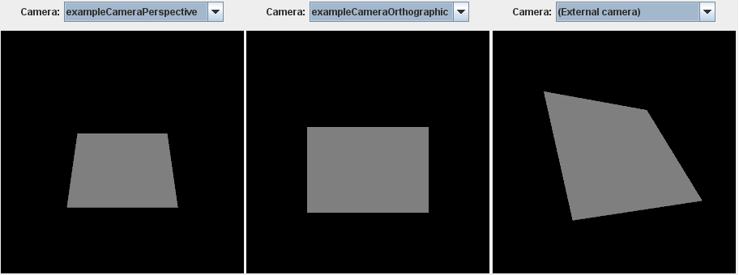

# glTF：Simple Cameras

前面幾節介紹了 glTF asset 中如何描述基本場景結構與幾何物件，以及如何對這些物件套用不同的材質，不過目前尚未說明如何設定場景的「觀察視角」，也就是我們所謂的虛擬相機（camera）。 在 glTF 中，相機會被放在場景中的某個節點（node）上，指定其位置與朝向，用來決定畫面呈現的視角

以下是一個簡單且完整的 glTF asset，它的結構與前面範例相似，包含一個 `scene`，內部有幾個 `node` 物件，以及一個幾何物件（`mesh`），綁定到其中一個 node 上，不同之處在於這個範例額外包含了兩個 [`camera`](https://www.khronos.org/registry/glTF/specs/2.0/glTF-2.0.html#reference-camera) 物件

```javascript
{
  "scene": 0,
  "scenes" : [
    {
      "nodes" : [ 0, 1, 2 ]
    }
  ],
  "nodes" : [
    {
      "rotation" : [ -0.383, 0.0, 0.0, 0.924 ],
      "mesh" : 0
    },
    {
      "translation" : [ 0.5, 0.5, 3.0 ],
      "camera" : 0
    },
    {
      "translation" : [ 0.5, 0.5, 3.0 ],
      "camera" : 1
    }
  ],

  "cameras" : [
    {
      "type": "perspective",
      "perspective": {
        "aspectRatio": 1.0,
        "yfov": 0.7,
        "zfar": 100,
        "znear": 0.01
      }
    },
    {
      "type": "orthographic",
      "orthographic": {
        "xmag": 1.0,
        "ymag": 1.0,
        "zfar": 100,
        "znear": 0.01
      }
    }
  ],

  "meshes" : [
    {
      "primitives" : [ {
        "attributes" : {
          "POSITION" : 1
        },
        "indices" : 0
      } ]
    }
  ],

  "buffers" : [
    {
      "uri" : "data:application/octet-stream;base64,AAABAAIAAQADAAIAAAAAAAAAAAAAAAAAAACAPwAAAAAAAAAAAAAAAAAAgD8AAAAAAACAPwAAgD8AAAAA",
      "byteLength" : 60
    }
  ],
  "bufferViews" : [
    {
      "buffer" : 0,
      "byteOffset" : 0,
      "byteLength" : 12,
      "target" : 34963
    },
    {
      "buffer" : 0,
      "byteOffset" : 12,
      "byteLength" : 48,
      "target" : 34962
    }
  ],
  "accessors" : [
    {
      "bufferView" : 0,
      "byteOffset" : 0,
      "componentType" : 5123,
      "count" : 6,
      "type" : "SCALAR",
      "max" : [ 3 ],
      "min" : [ 0 ]
    },
    {
      "bufferView" : 1,
      "byteOffset" : 0,
      "componentType" : 5126,
      "count" : 4,
      "type" : "VEC3",
      "max" : [ 1.0, 1.0, 0.0 ],
      "min" : [ 0.0, 0.0, 0.0 ]
    }
  ],

  "asset" : {
    "version" : "2.0"
  }
}
```

這份 asset 的幾何模型是單位正方形（unit square），它會繞著 x 軸旋轉 -45 度，以突顯不同相機的視角效果。 下圖 15a 展示了三種視角的渲染結果，前兩張是來自 asset 中的兩台相機，第三張則是使用外部、使用者自定義視角所看到的畫面：



## Camera definitions

The new top-level element of this glTF asset is the `cameras` array, which contains the  [`camera`](https://www.khronos.org/registry/glTF/specs/2.0/glTF-2.0.html#reference-camera) objects:

這個 glTF asset 新增了一個頂層的 `cameras` 陣列，裡面包含了一或多個 camera 物件，範例如下：

```javascript
"cameras" : [
  {
    "type": "perspective",
    "perspective": {
      "aspectRatio": 1.0,
      "yfov": 0.7,
      "zfar": 100,
      "znear": 0.01
    }
  },
  {
    "type": "orthographic",
    "orthographic": {
      "xmag": 1.0,
      "ymag": 1.0,
      "zfar": 100,
      "znear": 0.01
    }
  }
],
```

這裡定義了兩台相機：

- 第一台為透視相機（perspective camera），具有：
  - 視角（`yfov`）為 0.7 弧度；
  - 縱橫比（`aspectRatio`）為 1.0；
  - 近平面（`znear`）為 0.01；
  - 遠平面（`zfar`）為 100。
- 第二台為正交相機（orthographic camera），其視野範圍由 `xmag` 與 `ymag` 控制

定義完相機後，我們需將它指定到某個節點上，這可以透過將 camera 屬性設定為相機的 index 來完成，下例中有兩個節點，各自綁定一台相機：

```javascript
"nodes" : {
  ...
  {
    "translation" : [ 0.5, 0.5, 3.0 ],
    "camera" : 0
  },
  {
    "translation" : [ 0.5, 0.5, 3.0 ],
    "camera" : 1
  }
},
```

兩台相機都被放在位置 `[0.5, 0.5, 3.0]` 處，朝向場景中心，但因為它們使用不同的投影模式，最終渲染出來的視角感受會不同。 關於「透視相機 vs 正交相機」的差異、將相機掛載到節點上的效果、以及場景中管理多台相機的方法，會在下一節 Cameras 中做進一步說明
