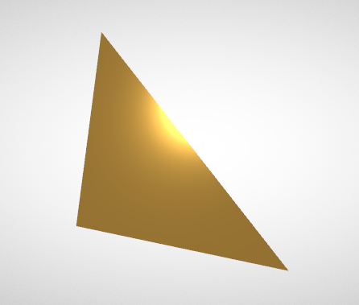

# glTF：A Simple Material

在前幾節中介紹的 glTF asset 範例，內容主要涵蓋了基本的場景結構與簡單的幾何物件，但這些範例都沒有包含物件的外觀資訊。 當未提供任何外觀資訊時，glTF 規範建議檢視器（viewer）應該使用一個「預設材質（default material）」來渲染物體，如同在「MinimalGltfFile」中的截圖中所見，根據場景中的光照條件，這個預設材質通常會使物件呈現純白或淺灰色的外觀

本節將從一個非常簡單的材質範例開始，並說明各種材質屬性所帶來的效果。 以下是一個最小化 glTF asset，包含一個簡單的材質設定：

```javascript
{
  "scene": 0,
  "scenes" : [
    {
      "nodes" : [ 0 ]
    }
  ],

  "nodes" : [
    {
      "mesh" : 0
    }
  ],

  "meshes" : [
    {
      "primitives" : [ {
        "attributes" : {
          "POSITION" : 1
        },
        "indices" : 0,
        "material" : 0
      } ]
    }
  ],

  "buffers" : [
    {
      "uri" : "data:application/octet-stream;base64,AAABAAIAAAAAAAAAAAAAAAAAAAAAAIA/AAAAAAAAAAAAAAAAAACAPwAAAAA=",
      "byteLength" : 44
    }
  ],
  "bufferViews" : [
    {
      "buffer" : 0,
      "byteOffset" : 0,
      "byteLength" : 6,
      "target" : 34963
    },
    {
      "buffer" : 0,
      "byteOffset" : 8,
      "byteLength" : 36,
      "target" : 34962
    }
  ],
  "accessors" : [
    {
      "bufferView" : 0,
      "byteOffset" : 0,
      "componentType" : 5123,
      "count" : 3,
      "type" : "SCALAR",
      "max" : [ 2 ],
      "min" : [ 0 ]
    },
    {
      "bufferView" : 1,
      "byteOffset" : 0,
      "componentType" : 5126,
      "count" : 3,
      "type" : "VEC3",
      "max" : [ 1.0, 1.0, 0.0 ],
      "min" : [ 0.0, 0.0, 0.0 ]
    }
  ],

  "materials" : [
    {
      "pbrMetallicRoughness": {
        "baseColorFactor": [ 1.000, 0.766, 0.336, 1.0 ],
        "metallicFactor": 0.5,
        "roughnessFactor": 0.1
      }
    }
  ],
  "asset" : {
    "version" : "2.0"
  }
}
```      

當這個 asset 被渲染時，畫面中會顯示出一個套用了新材質的三角形，如下圖 11a 所示：



## Material definition

為了定義這個材質，我們在 glTF JSON 的頂層新增了一個 `materials` 陣列，這個陣列包含一個元素，用來定義這個材質及其屬性：

```javascript
  "materials" : [
    {
      "pbrMetallicRoughness": {
        "baseColorFactor": [ 1.000, 0.766, 0.336, 1.0 ],
        "metallicFactor": 0.5,
        "roughnessFactor": 0.1
      }
    }
  ],
```

這裡的 [`material`](https://www.khronos.org/registry/glTF/specs/2.0/glTF-2.0.html#reference-material) 定義只包含一個 [`pbrMetallicRoughness`](https://www.khronos.org/registry/glTF/specs/2.0/glTF-2.0.html#reference-material-pbrmetallicroughness) 物件，這個物件定義了採用 metallic-roughness 模型下的一組基本材質屬性（所有其他材質屬性將採用預設值，稍後會說明這些預設值）

- `baseColorFactor`：指定材質的主要顏色，包含紅、綠、藍與透明度（RGBA）四個分量
    - 這裡設定的是亮橘色（1.0, 0.766, 0.336, 1.0）
- `metallicFactor = 0.5`：表示材質具有一半像金屬、一半像非金屬的反射特性
- `roughnessFactor = 0.1`：表面偏光滑，但不是完全鏡面，會讓反射光略為散射

## Assigning the material to objects

這個材質會套用在三角形上（也就是 `mesh.primitive` 上）。 它是透過材質的索引來指定的：

```javascript
  "meshes" : [
    {
      "primitives" : [ {
        "attributes" : {
          "POSITION" : 1
        },
        "indices" : 0,
        "material" : 0
      } ]
    }
  ],
```

這邊的 `"material": 0` 表示將 index 為 0 的材質套用到這個 primitive 上。 下一節將會簡要介紹 glTF 中貼圖（texture）的定義方式，而貼圖的使用會讓我們能夠建立更複雜、也更寫實的材質效果
