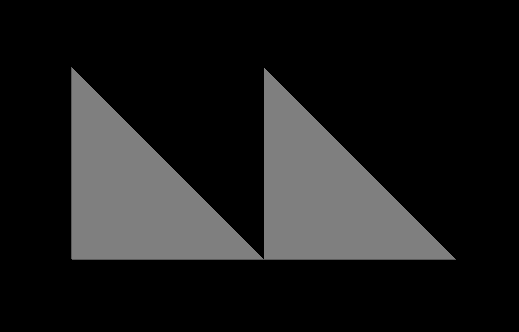

# glTF：Simple Meshes

[`mesh`](https://www.khronos.org/registry/glTF/specs/2.0/glTF-2.0.html#reference-mesh) 用來表示場景內的一個幾何物件。 我們在「MinimalGltfFile」中已經看過一個 mesh 的範例了，其中有一個 `mesh` 被掛載在一個 `node` 上，其只包含一個 [`mesh.primitive`](https://www.khronos.org/registry/glTF/specs/2.0/glTF-2.0.html#reference-mesh-primitive)，且當中只定義了一個頂點位置（vertex positions）的屬性（attribute）

但在實際應用中，mesh 的 primitive 通常會包含更多的屬性，可能會是：

- 頂點法線（vertex normals）
- 材質貼圖座標（texture coordinates）

以下是一個 glTF asset 的範例，它包含一個具有多種屬性的簡單 mesh，這個範例將作為後續說明相關概念的基礎：

```javascript
{
  "scene": 0,
  "scenes" : [
    {
      "nodes" : [ 0, 1 ]
    }
  ],
  "nodes" : [
    {
      "mesh" : 0
    },
    {
      "mesh" : 0,
      "translation" : [ 1.0, 0.0, 0.0 ]
    }
  ],
  
  "meshes" : [
    {
      "primitives" : [ {
        "attributes" : {
          "POSITION" : 1,
          "NORMAL" : 2
        },
        "indices" : 0
      } ]
    }
  ],

  "buffers" : [
    {
      "uri" : "data:application/octet-stream;base64,AAABAAIAAAAAAAAAAAAAAAAAAAAAAIA/AAAAAAAAAAAAAAAAAACAPwAAAAAAAAAAAAAAAAAAgD8AAAAAAAAAAAAAgD8AAAAAAAAAAAAAgD8=",
      "byteLength" : 80
    }
  ],
  "bufferViews" : [
    {
      "buffer" : 0,
      "byteOffset" : 0,
      "byteLength" : 6,
      "target" : 34963
    },
    {
      "buffer" : 0,
      "byteOffset" : 8,
      "byteLength" : 72,
      "target" : 34962
    }
  ],
  "accessors" : [
    {
      "bufferView" : 0,
      "byteOffset" : 0,
      "componentType" : 5123,
      "count" : 3,
      "type" : "SCALAR",
      "max" : [ 2 ],
      "min" : [ 0 ]
    },
    {
      "bufferView" : 1,
      "byteOffset" : 0,
      "componentType" : 5126,
      "count" : 3,
      "type" : "VEC3",
      "max" : [ 1.0, 1.0, 0.0 ],
      "min" : [ 0.0, 0.0, 0.0 ]
    },
    {
      "bufferView" : 1,
      "byteOffset" : 36,
      "componentType" : 5126,
      "count" : 3,
      "type" : "VEC3",
      "max" : [ 0.0, 0.0, 1.0 ],
      "min" : [ 0.0, 0.0, 1.0 ]
    }
  ],
  
  "asset" : {
    "version" : "2.0"
  }
}
```

下圖 8a 是該 glTF asset 渲染的結果：



## The mesh definition

這個範例仍然只包含一個 mesh，且這個 mesh 只包含一個 mesh primitive，但這個 mesh primitive 拓展了更多屬性（attributes）：

```javascript
  "meshes" : [
    {
      "primitives" : [ {
        "attributes" : {
          "POSITION" : 1,
          "NORMAL" : 2
        },
        "indices" : 0
      } ]
    }
  ],
```

除了 `"POSITION"`（頂點位置）屬性之外，它還多了一個 `"NORMAL"`（法線）屬性。 這個屬性指向對應的 accessor 物件，該物件提供了每個頂點的法線資訊。 這部分內容已在「Buffers, BufferViews, and Accessors」章節中說明過

## The rendered mesh instances

如圖 8a 所示，這個 mesh 被渲染了兩次。 這是透過將同一個 mesh 附加到兩個不同的節點來實現的：

```javascript
  "nodes" : [
    {
      "mesh" : 0
    },
    {
      "mesh" : 0,
      "translation" : [ 1.0, 0.0, 0.0 ]
    }
  ],
```

每個 node 的 `mesh` 屬性都透過 mesh 的索引值來指定對應的 mesh，其中一個 node 有設定 `translation`（位移），這使得該 mesh 會被渲染在不同的位置上。 下一節會更詳細說明 mesh 與 mesh primitive 的相關內容
