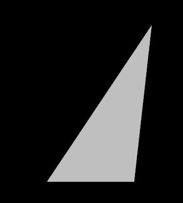

# glTF：A Simple Morph Target

從 glTF 2.0 開始，支援為 mesh 定義 morph target（變形目標），Morph target 是一組針對 mesh 某些屬性（如頂點位置）的差異或位移量，在執行階段可以以不同權重加到原始 mesh 上，藉此達成局部動畫變形的效果，這常用於角色動畫中，例如虛擬角色的不同臉部表情

以下是一個簡單的範例，展示了一個含有兩個 morph target 的 mesh。 這段會簡單列出新增的元素，至於 morph target 的完整概念與執行時如何應用，會在下一節詳細解釋

```javascript
{
  "scene": 0,
  "scenes":[
    {
      "nodes":[
        0
      ]
    }
  ],
  "nodes":[
    {
      "mesh":0
    }
  ],
  "meshes":[
    {
      "primitives":[
        {
          "attributes":{
            "POSITION":1
          },
          "targets":[
            {
              "POSITION":2
            },
            {
              "POSITION":3
            }
          ],
          "indices":0
        }
      ],
      "weights":[
        1.0,
        0.5
      ]
    }
  ],

  "animations":[
    {
      "samplers":[
        {
          "input":4,
          "interpolation":"LINEAR",
          "output":5
        }
      ],
      "channels":[
        {
          "sampler":0,
          "target":{
            "node":0,
            "path":"weights"
          }
        }
      ]
    }
  ],

  "buffers":[
    {
      "uri":"data:application/gltf-buffer;base64,AAABAAIAAAAAAAAAAAAAAAAAAAAAAIA/AAAAAAAAAAAAAAA/AAAAPwAAAAAAAAAAAAAAAAAAAAAAAAAAAAAAAAAAAAAAAIC/AACAPwAAAAAAAAAAAAAAAAAAAAAAAAAAAAAAAAAAAAAAAIA/AACAPwAAAAA=",
      "byteLength":116
    },
    {
      "uri":"data:application/gltf-buffer;base64,AAAAAAAAgD8AAABAAABAQAAAgEAAAAAAAAAAAAAAAAAAAIA/AACAPwAAgD8AAIA/AAAAAAAAAAAAAAAA",
      "byteLength":60
    }
  ],
  "bufferViews":[
    {
      "buffer":0,
      "byteOffset":0,
      "byteLength":6,
      "target":34963
    },
    {
      "buffer":0,
      "byteOffset":8,
      "byteLength":108,
      "byteStride":12,
      "target":34962
    },
    {
      "buffer":1,
      "byteOffset":0,
      "byteLength":20
    },
    {
      "buffer":1,
      "byteOffset":20,
      "byteLength":40
    }
  ],
  "accessors":[
    {
      "bufferView":0,
      "byteOffset":0,
      "componentType":5123,
      "count":3,
      "type":"SCALAR",
      "max":[
        2
      ],
      "min":[
        0
      ]
    },
    {
      "bufferView":1,
      "byteOffset":0,
      "componentType":5126,
      "count":3,
      "type":"VEC3",
      "max":[
        1.0,
        0.5,
        0.0
      ],
      "min":[
        0.0,
        0.0,
        0.0
      ]
    },
    {
      "bufferView":1,
      "byteOffset":36,
      "componentType":5126,
      "count":3,
      "type":"VEC3",
      "max":[
        0.0,
        1.0,
        0.0
      ],
      "min":[
        -1.0,
        0.0,
        0.0
      ]
    },
    {
      "bufferView":1,
      "byteOffset":72,
      "componentType":5126,
      "count":3,
      "type":"VEC3",
      "max":[
        1.0,
        1.0,
        0.0
      ],
      "min":[
        0.0,
        0.0,
        0.0
      ]
    },
    {
      "bufferView":2,
      "byteOffset":0,
      "componentType":5126,
      "count":5,
      "type":"SCALAR",
      "max":[
        4.0
      ],
      "min":[
        0.0
      ]
    },
    {
      "bufferView":3,
      "byteOffset":0,
      "componentType":5126,
      "count":10,
      "type":"SCALAR",
      "max":[
        1.0
      ],
      "min":[
        0.0
      ]
    }
  ],

  "asset":{
    "version":"2.0"
  }
}

```

The asset contains an animation that interpolates between the different morph targets for a single triangle. A screenshot of this asset is shown in Image 17a.

這個 asset 包含一個動畫，用來在一個三角形的兩個 morph target 之間做內插變形，結果如下圖 17a 所示：



這個 asset 的其他部分在前面章節都介紹過了，它包含一個 `scene`、一個 `node`、一個 `mesh`，還有兩個 `buffer`（一個存幾何資料、一個存動畫資料）與多個 `bufferView` 與 `accessor` 提供資料存取

我們新增來定義 morph target 的部分，分別位於 `mesh` 與 `animation` 中：

```javascript
  "meshes":[
    {
      "primitives":[
        {
          "attributes":{
            "POSITION":1
          },
          "targets":[
            {
              "POSITION":2
            },
            {
              "POSITION":3
            }
          ],
          "indices":0
        }
      ],
      "weights":[
        0.5,
        0.5
      ]
    }
  ],

```

`mesh.primitive` 中新增的 targets 陣列表示 [morph `targets`](https://www.khronos.org/registry/glTF/specs/2.0/glTF-2.0.html#_mesh_primitive_targets)，每個 target 是一個對應 attribute 名稱（如 `"POSITION"`）到某個 `accessor` 的對應表

在這個例子中，我們有兩個 morph target，都針對 `POSITION` 做變形，`weights` 陣列指定這些 morph target 的初始權重，動畫會改變這些 morph target 的權重，因此它的 `channel.target.path` 是 `"weights"`，如下所示：

```javascript
  "animations":[
    {
      "samplers":[
        {
          "input":4,
          "interpolation":"LINEAR",
          "output":5
        }
      ],
      "channels":[
        {
          "sampler":0,
          "target":{
            "node":0,
            "path":"weights"
          }
        }
      ]
    }
  ],

```

也就是說，這段動畫會動態修改 node（索引 0）所綁定 mesh 的 morph weights，透過這樣的方式，最終渲染出來的 mesh 會依照動畫時間變化，在多個變形目標之間進行插值與混合

下一節 Morph Targets 會進一步說明動畫套用到 morph weights 之後，如何實際影響 mesh 的渲染結果。