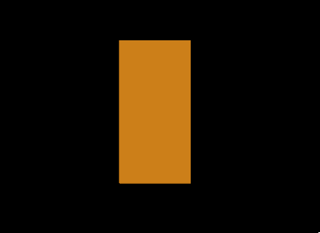

# glTF：A Simple Skin

glTF 支援 vertex skinning（頂點綁定），這項功能可以根據骨架的姿勢去變形 mesh（網格）上的幾何資料（頂點），這對於製作具有動作的虛擬角色等動畫場景來說至關重要。 glTF 中關於 vertex skinning 的核心是 [`skin`](https://www.khronos.org/registry/glTF/specs/2.0/glTF-2.0.html#reference-skin) 物件，不過實際實現頂點綁定時，會牽涉到 glTF 中其他部分的交互依賴，這些部分前面章節中都有介紹過

以下是一個 glTF asset 範例，展示了針對簡單幾何物件進行 vertex skinning 的方式。 這一節會快速總結這個 asset 的組成，並回顧之前章節中提過的相關內容，同時指出為了支援 vertex skinning 所新增的元素。 關於頂點綁定的原理與詳細解釋，將會在下一節中說明

```javascript
{
  "scene" : 0,
  "scenes" : [ {
    "nodes" : [ 0, 1 ]
  } ],
  
  "nodes" : [ {
    "skin" : 0,
    "mesh" : 0
  }, {
    "children" : [ 2 ]
  }, {
    "translation" : [ 0.0, 1.0, 0.0 ],
    "rotation" : [ 0.0, 0.0, 0.0, 1.0 ]
  } ],
  
  "meshes" : [ {
    "primitives" : [ {
      "attributes" : {
        "POSITION" : 1,
        "JOINTS_0" : 2,
        "WEIGHTS_0" : 3
      },
      "indices" : 0
    } ]
  } ],

  "skins" : [ {
    "inverseBindMatrices" : 4,
    "joints" : [ 1, 2 ]
  } ],
  
  "animations" : [ {
    "channels" : [ {
      "sampler" : 0,
      "target" : {
        "node" : 2,
        "path" : "rotation"
      }
    } ],
    "samplers" : [ {
      "input" : 5,
      "interpolation" : "LINEAR",
      "output" : 6
    } ]
  } ],
  
  "buffers" : [ {
    "uri" : "data:application/gltf-buffer;base64,AAABAAMAAAADAAIAAgADAAUAAgAFAAQABAAFAAcABAAHAAYABgAHAAkABgAJAAgAAAAAvwAAAAAAAAAAAAAAPwAAAAAAAAAAAAAAvwAAAD8AAAAAAAAAPwAAAD8AAAAAAAAAvwAAgD8AAAAAAAAAPwAAgD8AAAAAAAAAvwAAwD8AAAAAAAAAPwAAwD8AAAAAAAAAvwAAAEAAAAAAAAAAPwAAAEAAAAAA",
    "byteLength" : 168
  }, {
    "uri" : "data:application/gltf-buffer;base64,AAAAAAAAAAAAAAAAAAAAAAAAAAAAAAAAAAAAAAAAAAAAAAEAAAAAAAAAAAAAAAAAAAABAAAAAAAAAAAAAAAAAAAAAQAAAAAAAAAAAAAAAAAAAAEAAAAAAAAAAAAAAAAAAAABAAAAAAAAAAAAAAAAAAAAAQAAAAAAAAAAAAAAAAAAAAEAAAAAAAAAAAAAAAAAAAABAAAAAAAAAAAAAAAAAAAAgD8AAAAAAAAAAAAAAAAAAIA/AAAAAAAAAAAAAAAAAABAPwAAgD4AAAAAAAAAAAAAQD8AAIA+AAAAAAAAAAAAAAA/AAAAPwAAAAAAAAAAAAAAPwAAAD8AAAAAAAAAAAAAgD4AAEA/AAAAAAAAAAAAAIA+AABAPwAAAAAAAAAAAAAAAAAAgD8AAAAAAAAAAAAAAAAAAIA/AAAAAAAAAAA=",
    "byteLength" : 320
  }, {
    "uri" : "data:application/gltf-buffer;base64,AACAPwAAAAAAAAAAAAAAAAAAAAAAAIA/AAAAAAAAAAAAAAAAAAAAAAAAgD8AAAAAAAAAAAAAAAAAAAAAAACAPwAAgD8AAAAAAAAAAAAAAAAAAAAAAACAPwAAAAAAAAAAAAAAAAAAAAAAAIA/AAAAAAAAAAAAAIC/AAAAAAAAgD8=",
    "byteLength" : 128
  }, {
    "uri" : "data:application/gltf-buffer;base64,AAAAAAAAAD8AAIA/AADAPwAAAEAAACBAAABAQAAAYEAAAIBAAACQQAAAoEAAALBAAAAAAAAAAAAAAAAAAACAPwAAAAAAAAAAkxjEPkSLbD8AAAAAAAAAAPT9ND/0/TQ/AAAAAAAAAAD0/TQ/9P00PwAAAAAAAAAAkxjEPkSLbD8AAAAAAAAAAAAAAAAAAIA/AAAAAAAAAAAAAAAAAACAPwAAAAAAAAAAkxjEvkSLbD8AAAAAAAAAAPT9NL/0/TQ/AAAAAAAAAAD0/TS/9P00PwAAAAAAAAAAkxjEvkSLbD8AAAAAAAAAAAAAAAAAAIA/",
    "byteLength" : 240
  } ],
  
  "bufferViews" : [ {
    "buffer" : 0,
    "byteLength" : 48,
    "target" : 34963
  }, {
    "buffer" : 0,
    "byteOffset" : 48,
    "byteLength" : 120,
    "target" : 34962
  }, {
    "buffer" : 1,
    "byteLength" : 320,
    "byteStride" : 16
  }, {
    "buffer" : 2,
    "byteLength" : 128
  }, {
    "buffer" : 3,
    "byteLength" : 240
  } ],

  "accessors" : [ {
    "bufferView" : 0,
    "componentType" : 5123,
    "count" : 24,
    "type" : "SCALAR"
  }, {
    "bufferView" : 1,
    "componentType" : 5126,
    "count" : 10,
    "type" : "VEC3",
    "max" : [ 0.5, 2.0, 0.0 ],
    "min" : [ -0.5, 0.0, 0.0 ]
  }, {
    "bufferView" : 2,
    "componentType" : 5123,
    "count" : 10,
    "type" : "VEC4"
  }, {
    "bufferView" : 2,
    "byteOffset" : 160,
    "componentType" : 5126,
    "count" : 10,
    "type" : "VEC4"
  }, {
    "bufferView" : 3,
    "componentType" : 5126,
    "count" : 2,
    "type" : "MAT4"
  }, {
    "bufferView" : 4,
    "componentType" : 5126,
    "count" : 12,
    "type" : "SCALAR",
    "max" : [ 5.5 ],
    "min" : [ 0.0 ]
  }, {
    "bufferView" : 4,
    "byteOffset" : 48,
    "componentType" : 5126,
    "count" : 12,
    "type" : "VEC4",
    "max" : [ 0.0, 0.0, 0.707, 1.0 ],
    "min" : [ 0.0, 0.0, -0.707, 0.707 ]
  } ],
 
  "asset" : {
    "version" : "2.0"
  }
}
```

這個 asset 渲染出來的畫面如下圖 19a 所示：



## Elements of the simple skin example

這個例子中的元素簡述如下：

`scenes` 和 `nodes` 的結構在 Scenes and Nodes 一節中已有介紹。 為了實現 vertex skinning，本例中新增了一組骨架結構，節點編號 1 和 2 的 node 組成了這個 skeleton（骨架），你可以把它們看作是骨頭與骨頭之間的「關節」，會用來驅動 mesh 的變形

本例新增了一個頂層的字典 `skins`，裡面包含了一個 skin 物件（在 glTF 中是可選但實現綁定的關鍵），skin 的具體屬性會在下一節說明

關於動畫的概念，在 Animations 中已經有講解。 在這裡，`animation` 是用來驅動骨架節點的變化，藉此觸發 mesh 的變形。 在 Meshes 一節中我們還介紹了 `meshes` 和 `mesh.primitive` 的基本結構。 本例中，mesh primitive 額外加入了兩個新的 attribute：

- `"JOINTS_0"`：每個頂點受哪些關節控制
- `"WEIGHTS_0"`：每個頂點對應控制關節的影響權重

此外還新增了許多 buffers、bufferViews 和 accessors，來儲存上述 `"JOINTS_0"` 與 `"WEIGHTS_0"` 所需的資料，這些結構的基本原理在 Buffers, BufferViews, and Accessors 已說明

關於這些元素之間如何互相連結、共同實現 vertex skinning 的細節，會在下一節 Skins 中說明
