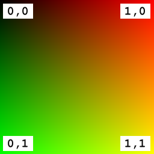
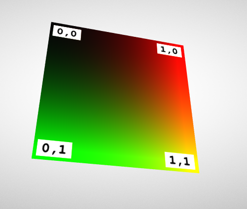

# glTF：A Simple Texture

如前幾節所示，glTF asset 中的材質定義可以包含多種參數，這些參數用來描述物件在光照下的顏色或整體外觀。 這些屬性可以直接以單一數值表示，例如整體的顏色或 roughness 值。 但也可以透過貼圖（texture）指定，並映射到物件表面上

下列是一個 glTF asset 範例，它定義了一個套用簡單貼圖的材質：

```javascript
{
  "scene": 0,
  "scenes" : [ {
    "nodes" : [ 0 ]
  } ],
  "nodes" : [ {
    "mesh" : 0
  } ],
  "meshes" : [ {
    "primitives" : [ {
      "attributes" : {
        "POSITION" : 1,
        "TEXCOORD_0" : 2
      },
      "indices" : 0,
      "material" : 0
    } ]
  } ],

  "materials" : [ {
    "pbrMetallicRoughness" : {
      "baseColorTexture" : {
        "index" : 0
      },
      "metallicFactor" : 0.0,
      "roughnessFactor" : 1.0
    }
  } ],

  "textures" : [ {
    "sampler" : 0,
    "source" : 0
  } ],
  "images" : [ {
    "uri" : "testTexture.png"
  } ],
  "samplers" : [ {
    "magFilter" : 9729,
    "minFilter" : 9987,
    "wrapS" : 33648,
    "wrapT" : 33648
  } ],

  "buffers" : [ {
    "uri" : "data:application/gltf-buffer;base64,AAABAAIAAQADAAIAAAAAAAAAAAAAAAAAAACAPwAAAAAAAAAAAAAAAAAAgD8AAAAAAACAPwAAgD8AAAAAAAAAAAAAgD8AAAAAAACAPwAAgD8AAAAAAAAAAAAAAAAAAAAAAACAPwAAAAAAAAAA",
    "byteLength" : 108
  } ],
  "bufferViews" : [ {
    "buffer" : 0,
    "byteOffset" : 0,
    "byteLength" : 12,
    "target" : 34963
  }, {
    "buffer" : 0,
    "byteOffset" : 12,
    "byteLength" : 96,
    "byteStride" : 12,
    "target" : 34962
  } ],
  "accessors" : [ {
    "bufferView" : 0,
    "byteOffset" : 0,
    "componentType" : 5123,
    "count" : 6,
    "type" : "SCALAR",
    "max" : [ 3 ],
    "min" : [ 0 ]
  }, {
    "bufferView" : 1,
    "byteOffset" : 0,
    "componentType" : 5126,
    "count" : 4,
    "type" : "VEC3",
    "max" : [ 1.0, 1.0, 0.0 ],
    "min" : [ 0.0, 0.0, 0.0 ]
  }, {
    "bufferView" : 1,
    "byteOffset" : 48,
    "componentType" : 5126,
    "count" : 4,
    "type" : "VEC2",
    "max" : [ 1.0, 1.0 ],
    "min" : [ 0.0, 0.0 ]
  } ],

  "asset" : {
    "version" : "2.0"
  }
}
```

實際的貼圖圖片是名為 `"testTexture.png"` 的 PNG 圖檔，見下圖 13a：



將上述設定整合後進行渲染，畫面效果如下圖 13b 所示：



## The Textured Material Definition

這裡的材質定義與前面介紹的 Simple Material 範例不同，前者僅為整個物件設定一個單一顏色，而這裡則加入了貼圖的引用：

```javascript
"materials" : [ {
  "pbrMetallicRoughness" : {
    "baseColorTexture" : {
      "index" : 0
    },
    "metallicFactor" : 0.0,
    "roughnessFactor" : 1.0
  }
} ],
```

- `baseColorTexture.index = 0` 表示這個材質要使用 index 為 0 的貼圖，貼到物件表面
- `metallicFactor = 0.0` 表示完全非金屬
- `roughnessFactor = 1.0` 表示非常粗糙的表面（完全無鏡面反射）

目前 `metallicFactor` 與 `roughnessFactor` 還是用單一數值指定，下一節會展示這些屬性也透過貼圖來控制的更複雜材質設定

要將貼圖正確套用到 mesh primitive 上，必須為每個頂點提供一組貼圖座標（texture coordinates），這些貼圖座標只是頂點的一項屬性，會定義在 `mesh.primitive` 的 attributes 區塊中

預設情況下，貼圖會使用名為 `TEXCOORD_0` 的貼圖座標屬性，如果有多組貼圖座標（例如 UV0、UV1、UV2⋯），可以透過 `texCoord` 屬性來指定某一組要用哪個 index：

```javascript
"baseColorTexture" : {
  "index" : 0,
  "texCoord": 2  
},
```

上面的例子表示要使用名為 `TEXCOORD_2` 的貼圖座標來對應這張貼圖
