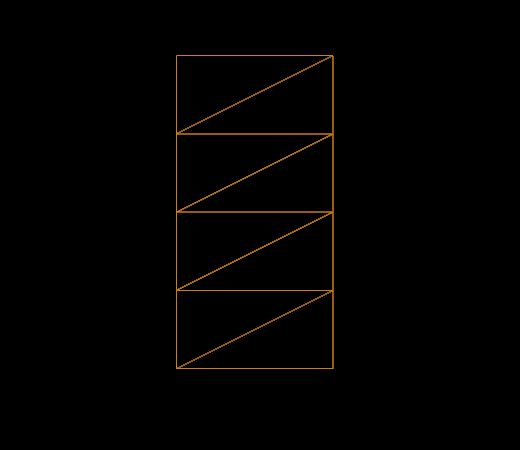
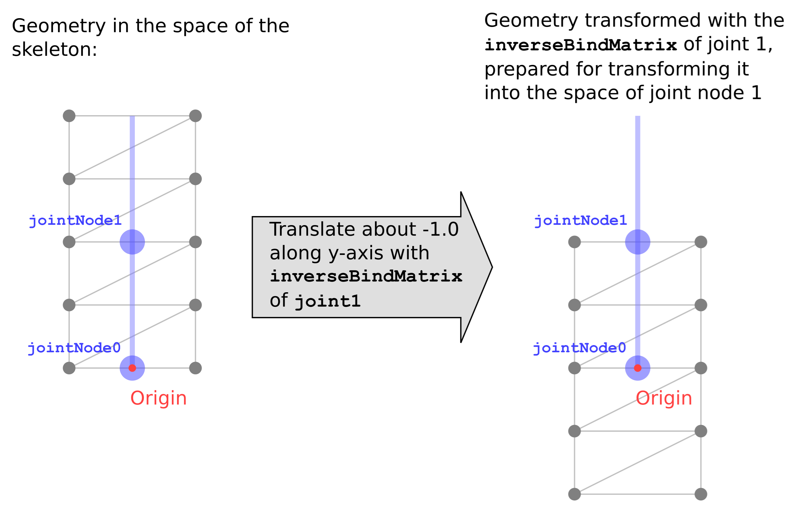
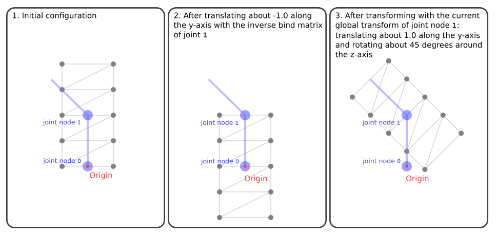
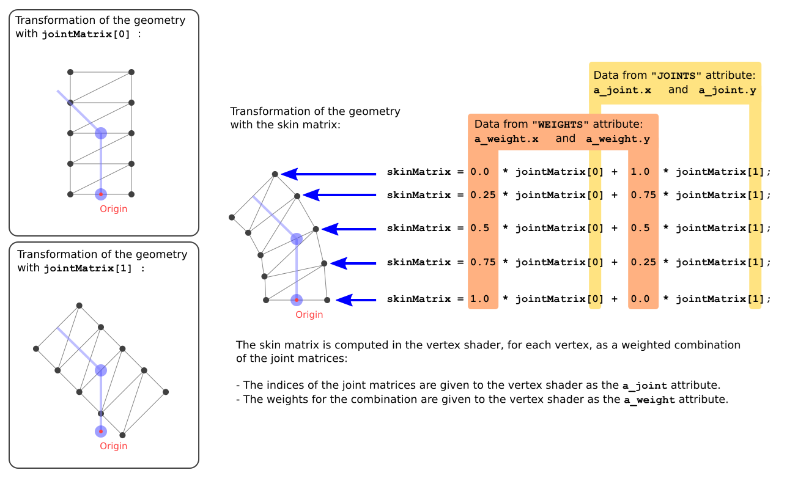
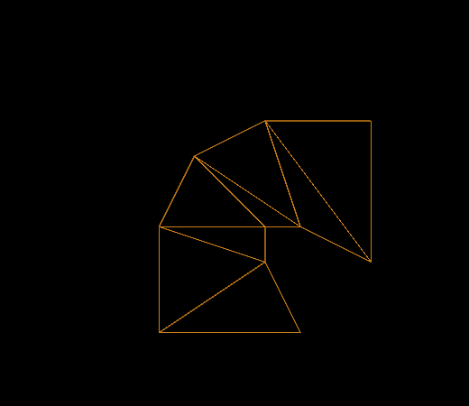

# glTF：Skins

頂點綁定（vertex skinning）的流程相對複雜，它幾乎整合了 glTF asset 中的所有元素，本節將根據前一節 Simple Skin 中的範例，說明頂點綁定的基本概念

## The geometry data

在這個頂點綁定的範例中，幾何是一個有索引的三角形網格，總共包含 8 個三角形、10 個頂點，這些頂點組成了位於 xy 平面上的一個矩形，其寬度為 1.0、高度為 2.0，矩形的底部中心位於原點 `(0, 0, 0)`，因此頂點的位置如下：

```
-0.5, 0.0, 0.0,
 0.5, 0.0, 0.0,
-0.5, 0.5, 0.0,
 0.5, 0.5, 0.0,
-0.5, 1.0, 0.0,
 0.5, 1.0, 0.0,
-0.5, 1.5, 0.0,
 0.5, 1.5, 0.0,
-0.5, 2.0, 0.0,
 0.5, 2.0, 0.0
```

這些三角形的索引如下（每三個數字定義一個三角形）：

```
0, 1, 3,
0, 3, 2,
2, 3, 5,
2, 5, 4,
4, 5, 7,
4, 7, 6,
6, 7, 9,
6, 9, 8,
```

這些原始資料儲存在第一個 `buffer` 裡，其中索引與頂點位置分別由 `bufferView` 編號 0 和 1 所定義，並透過 `accessor` 編號 0 和 1 提供結構化的型別存取

下圖 20a 使用描邊方式渲染這個幾何，方便觀察其結構：



這份幾何資料位於整個場景中唯一的 mesh 所屬的 mesh primitive 中，而該 mesh 又被附加在場景的主要節點（main node）上。 這個 mesh primitive 還包含了額外的 attribute，也就是 `"JOINTS_0"` 和 `"WEIGHTS_0"`，它們在下一段中會說明它們在 skinning 中的功能與意義

## The skeleton structure

在這個範例中，場景中有兩個節點（node）定義了骨架，它們被稱為「骨架節點（skeleton nodes）」或「關節節點（joint nodes）」，可以把它們想像成骨骼之間的關節。 `skin` 會透過 `joints` 屬性列出這些節點的索引以引用它們：

```javascript
  "nodes" : [ 
   ...
   {
    "children" : [ 2 ]
   }, 
   {
    "translation" : [ 0.0, 1.0, 0.0 ],
    "rotation" : [ 0.0, 0.0, 0.0, 1.0 ]
   }
  ],
```

第一個關節節點位於原點，沒有定義任何變換（transform），第二個節點有一個 `translation` 屬性，表示在 y 軸方向上平移 1.0 單位，以及一個 `rotation` 屬性，初始為不旋轉（也就是 0 度）。 這個旋轉值稍後會由動畫修改，使骨架左右擺動，進而產生頂點變形的效果

## The skin

`skin` 是頂點綁定（vertex skinning）的核心元素，在此範例中，只定義了一個 `skin`：

```javascript
  "skins" : [ 
   {
    "inverseBindMatrices" : 4,
    "joints" : [ 1, 2 ]
   }
  ],
```

這個 skin 有一個 `joints` 陣列，列出構成骨架的節點索引。 此外，還有一個 `inverseBindMatrices` 屬性，它引用一個 accessor，該 accessor 為每個關節提供一個對應的矩陣。 這些矩陣的作用是將幾何資料轉換到對應關節的座標空間中，換句話說，它們是每個關節在初始姿勢下，其全域轉換矩陣的反矩陣

在本範例中，第 0 個關節（joint 0）沒有定義任何變換，所以它的全域轉換是單位矩陣，因此其 inverse bind matrix 也就是單位矩陣。 而第 1 個關節（joint 1）有一個 y 軸正向平移 1.0 的變換，因此它的 inverse bind matrix 是對應的負向平移：

$$
\begin{bmatrix}
1.0 & 0.0 & 0.0 & 0.0 \\
0.0 & 1.0 & 0.0 & -1.0 \\
0.0 & 0.0 & 1.0 & 0.0 \\
0.0 & 0.0 & 0.0 & 1.0
\end{bmatrix}
$$

這個矩陣將 mesh 沿著 y 軸向下平移 1.0，如下圖 20b 所示：



這個轉換一開始看起來可能有些違反直覺，但它的目的是要將受綁定頂點的座標轉換到該關節的局部空間中

## Vertex skinning implementation

一般來說，開發者在使用現成的渲染函式庫時幾乎不需要手動處理 glTF 中的 skin 資料，實際的頂點綁定運算通常會在 vertex shader 中執行，這屬於底層實作細節

不過，理解頂點綁定資料是如何被處理的，有助於建構正確且有效的 skin 模型。 因此，接下來會簡單介紹 skin 的運作方式，包含 pseudocode 和一些 GLSL 範例

### The joint matrices

在 skinned mesh 的頂點最終位置會由 vertex shader（頂點著色器）計算，在這些計算過程中，vertex shader 必須考慮目前骨架的姿勢，才能正確地計算出頂點位置。 這些資訊會透過一個矩陣陣列傳遞給 shader，這個矩陣陣列就是 joint matrices（關節矩陣）

它是一個 `uniform` 陣列變數，裡面包含了每個 joint（關節）對應的一個 4×4 矩陣。 在 shader 中，我們會根據對應的 joint 和 weight 組合出每個頂點的實際 skinning 矩陣，如下所示：

```glsl
...
uniform mat4 u_jointMat[2];

...
void main(void)
{
    mat4 skinMat =
        a_weight.x * u_jointMat[int(a_joint.x)] +
        a_weight.y * u_jointMat[int(a_joint.y)] +
        a_weight.z * u_jointMat[int(a_joint.z)] +
        a_weight.w * u_jointMat[int(a_joint.w)];
    ....
}
```

這個 skinMat 將應用到每個頂點上，以完成變形，每個關節對應的 joint matrix 的計算邏輯如下：

- 頂點要先乘上該關節的 `inverseBindMatrix`，這會把頂點轉換到關節的座標空間中
- 然後再乘上該關節目前的 global transform，表示該關節經由動畫變動後的位置與姿勢

所以，第 j 個 joint 的 joint matrix 計算 pseudocode 如下：

```ini
jointMatrix(j) = globalTransformOfJointNode(j) * inverseBindMatrixForJoint(j);
```

在其他格式（如 COLLADA）中，vertex skinning 有時候會額外使用一個叫做 "Bind Shape Matrix" 的矩陣，用來將 mesh 原始幾何轉換到骨架空間。 但在 glTF 中並沒有這個矩陣，此時這個轉換會被假設為：

- 要嘛已經被乘進 mesh 資料中（premultiplied）
- 要嘛已經整合進 inverse bind matrices

下圖 20c 顯示了在 Simple Skin 範例中，如何使用 joint 1 的 joint matrix 對 mesh 幾何進行轉換。該圖展示的是動畫執行到中間時的狀態，也就是 joint 1 的 rotation 已被動畫旋轉到 z 軸 45 度的角度



最右邊的圖顯示了如果 geometry 只套用了 joint 1 的 joint matrix，會呈現什麼樣子。 實際上，這樣的狀態從不會真正顯示出來，vertex shader 會依據每個頂點的 joints 與 weights，將多個 joint 的變形疊加加權起來，計算出最終的頂點位置

### The skinning joints and weights

如前所述，mesh.primitive 包含了兩個在 vertex skinning 中必要的新屬性，分別是 `"JOINTS_0"` 和 `"WEIGHTS_0"`，每一個屬性都對應到一個 accessor，為 mesh 中的每一個頂點提供一組資料

`"JOINTS_0"` 屬性所指向的 accessor 中，存有每個頂點受到哪些 joints（關節）的影響，為了效率與簡化處理，這些 joint index 通常以 4 維向量的形式儲存，這代表每個頂點最多可以被 4 個 joints 影響

以下是範例中的數據：

```
Vertex 0:  0, 0, 0, 0,
Vertex 1:  0, 0, 0, 0,
Vertex 2:  0, 1, 0, 0,
Vertex 3:  0, 1, 0, 0,
Vertex 4:  0, 1, 0, 0,
Vertex 5:  0, 1, 0, 0,
Vertex 6:  0, 1, 0, 0,
Vertex 7:  0, 1, 0, 0,
Vertex 8:  0, 1, 0, 0,
Vertex 9:  0, 1, 0, 0,
```

這代表每個頂點都會受到 joint 0 和 joint 1 的影響，但第 0、1 個頂點只受到 joint 0 的影響，第 8、9 個頂點則只受到 joint 1 的影響。其餘兩個分量則未使用。在更複雜的情況中，像這樣的 joint index 向量也可能是：

```
3, 1, 8, 4,
```

這表示該頂點會受到 joints 3、1、8、4 的影響

`"WEIGHTS_0"` 則定義每個 joint 對頂點的影響程度（權重），對應資料如下：

```
Vertex 0:  1.00,  0.00,  0.0, 0.0,
Vertex 1:  1.00,  0.00,  0.0, 0.0,
Vertex 2:  0.75,  0.25,  0.0, 0.0,
Vertex 3:  0.75,  0.25,  0.0, 0.0,
Vertex 4:  0.50,  0.50,  0.0, 0.0,
Vertex 5:  0.50,  0.50,  0.0, 0.0,
Vertex 6:  0.25,  0.75,  0.0, 0.0,
Vertex 7:  0.25,  0.75,  0.0, 0.0,
Vertex 8:  0.00,  1.00,  0.0, 0.0,
Vertex 9:  0.00,  1.00,  0.0, 0.0,
```

同樣地，最後兩個分量會被忽略，因為只使用了 2 個 joints，舉例來說，第 6 個頂點的資料表示它會受到 joint 0 的 25% 影響，以及 joint 1 的 75% 影響

這些資料會傳遞給 vertex shader，shader 中會根據 `"JOINTS_0"` 和 `"WEIGHTS_0"` 組合對應的 joint matrices，計算出每個頂點的 skin matrix，如下所示：

```glsl
...
attribute vec4 a_joint;
attribute vec4 a_weight;

uniform mat4 u_jointMat[2];

...
void main(void)
{
    mat4 skinMat =
        a_weight.x * u_jointMat[int(a_joint.x)] +
        a_weight.y * u_jointMat[int(a_joint.y)] +
        a_weight.z * u_jointMat[int(a_joint.z)] +
        a_weight.w * u_jointMat[int(a_joint.w)];
    vec4 worldPosition = skinMat * vec4(a_position,1.0);
    vec4 cameraPosition = u_viewMatrix * worldPosition;
    gl_Position = u_projectionMatrix * cameraPosition;
}
```

這個 skin matrix 就是將所有 joints 對該頂點的影響依據權重加總後的結果，然後拿來轉換頂點位置進入 world space，注意 node 本身的 transform 並不會再另外乘進來，因為其影響已被融合進 skin matrix 中

下圖 20d 示意了 skin matrix 如何被組合計算：



而下圖 20e 則展示了在動畫過程中實際應用 skin matrix 對幾何的變形效果：


